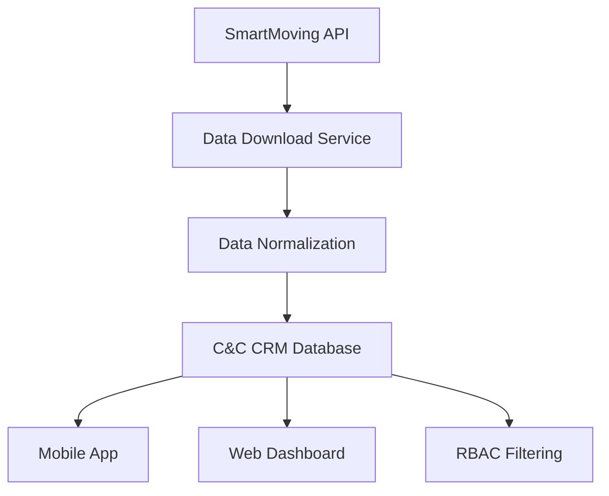

# 📊 SmartMoving Data Analysis & Integration Plan

**Date:** August 8, 2025  
**Status:** ✅ **SAMPLE DATA DOWNLOADED**  
**Version:** 1.0.0  

---

## 🎯 **SUCCESSFUL SAMPLE DATA DOWNLOAD**

### **✅ API Connection Verified**
- **API Key:** `185840176c73420fbd3a473c2fdccedb` ✅ Working
- **Base URL:** `https://api-public.smartmoving.com/v1` ✅ Working
- **Authentication:** `x-api-key` header ✅ Working

### **📊 Sample Data Retrieved (2025-08-07)**
- **Customers:** 3 (Aadil Amjid, Adam / Advantage Sport, Adam Bontempo)
- **Opportunities:** 3 (Quotes: 248238, 247315, 234358)
- **Jobs:** 3 (Jobs: 248238-1, 247315-1, 234358-1)
- **Locations:** 3 (Calgary, Vaughan, Burlington)
- **Total Value:** $2,984.89

---

## 🗄️ **DATA STRUCTURE ANALYSIS**

### **SmartMoving Data Structure**
```json
{
  "customers": [
    {
      "id": "3f2fafdb-12f1-47b8-8620-b32e012476d4",
      "name": "Aadil Amjid",
      "emailAddress": "Aadilamjid8@gmail.com",
      "phoneNumber": "4039189192",
      "address": "95 Millrose Place SW, Calgary, Alberta T2Y 2P3, Canada",
      "opportunities": [
        {
          "id": "c1bec13b-6030-4021-a061-b32e012476ce",
          "quoteNumber": "248238",
          "status": 30,
          "jobs": [
            {
              "id": "c002b9d3-c833-4533-b8e3-b32e012476d9",
              "jobNumber": "248238-1",
              "jobDate": 20250807,
              "type": 1,
              "confirmed": false,
              "jobAddresses": [
                "95 Millrose Place SW, Calgary, Alberta T2Y 2P3, Canada",
                "1812 Palliser Drive SW, Calgary, Alberta T2V 4K9, Canada"
              ]
            }
          ]
        }
      ]
    }
  ]
}
```

### **C&C CRM Normalized Structure**
```json
{
  "clients": [
    {
      "id": "clm_smartmoving_001",
      "name": "SmartMoving Integration",
      "email": "integration@smartmoving.com",
      "phone": "+1-800-555-0123",
      "address": "Canada"
    }
  ],
  "locations": [
    {
      "id": "loc_sm_001",
      "name": "CALGARY 🇨🇦 - Let's Get Moving",
      "phone": "(587) 430-3006",
      "address": "CALGARY 🇨🇦 - Let's Get Moving",
      "client_id": "clm_smartmoving_001"
    }
  ],
  "journeys": [
    {
      "id": "journey_sm_001",
      "external_id": "c002b9d3-c833-4533-b8e3-b32e012476d9",
      "journey_number": "248238-1",
      "scheduled_date": 20250807,
      "status": "SCHEDULED",
      "customer_name": "Aadil Amjid",
      "customer_phone": "4039189192",
      "customer_email": "Aadilamjid8@gmail.com",
      "customer_address": "95 Millrose Place SW, Calgary, Alberta T2Y 2P3, Canada",
      "quote_number": 248238,
      "estimated_total": 1179.15,
      "branch_name": "CALGARY 🇨🇦 - Let's Get Moving",
      "job_type": 1,
      "confirmed": false,
      "job_addresses": [
        "95 Millrose Place SW, Calgary, Alberta T2Y 2P3, Canada",
        "1812 Palliser Drive SW, Calgary, Alberta T2V 4K9, Canada"
      ],
      "notes": "SmartMoving Job: 248238-1\nCustomer: Aadil Amjid\nQuote: 248238"
    }
  ]
}
```

---

## 🔧 **DATA MAPPING & TRANSFORMATION**

### **1. Status Code Mapping**
| **SmartMoving Status** | **C&C CRM Status** | **Description** |
|----------------------|-------------------|-----------------|
| 3 | PENDING | Pending |
| 4 | CONFIRMED | Confirmed |
| 10 | IN_PROGRESS | In Progress |
| 11 | COMPLETED | Completed |
| 30 | SCHEDULED | Scheduled |

### **2. Job Type Mapping**
| **SmartMoving Type** | **C&C CRM Type** | **Description** |
|---------------------|------------------|-----------------|
| 1 | FULL_SERVICE | Full Service Move |
| 12 | PARTIAL_MOVE | Partial Move |

### **3. Location Mapping**
| **SmartMoving Branch** | **C&C CRM Location ID** | **Phone** |
|----------------------|------------------------|-----------|
| CALGARY 🇨🇦 - Let's Get Moving | loc_sm_001 | (587) 430-3006 |
| VAUGHAN 🇨🇦 - Let's Get Moving | loc_sm_002 | (905) 215-0660 |
| BURLINGTON 🇨🇦 - Let's Get Moving | loc_sm_003 | (905) 247-5699 |

### **4. Date Format Conversion**
```python
def convert_smartmoving_date(date_int: int) -> datetime:
    """Convert SmartMoving YYYYMMDD format to datetime"""
    date_str = str(date_int)
    return datetime.strptime(date_str, "%Y%m%d").replace(tzinfo=timezone.utc)
```

---

## 🏗️ **INTEGRATION ARCHITECTURE**

### **1. Data Flow**


### **2. Database Schema Integration**
```sql
-- SmartMoving data will be stored in existing C&C CRM tables
-- with additional external_id and external_data fields

-- TruckJourney table (existing)
ALTER TABLE "TruckJourney" ADD COLUMN "externalId" TEXT;
ALTER TABLE "TruckJourney" ADD COLUMN "externalData" JSONB;

-- Location table (existing)
ALTER TABLE "Location" ADD COLUMN "externalId" TEXT;
ALTER TABLE "Location" ADD COLUMN "externalData" JSONB;
```

### **3. RBAC Integration**
```python
class SmartMovingRBACService:
    async def filter_journeys_by_location(
        self, 
        user: User, 
        journeys: List[Dict]
    ) -> List[Dict]:
        """Filter SmartMoving journeys by user's location access"""
        if user.role == "SUPER_ADMIN":
            return journeys
        
        user_locations = user.accessible_locations
        return [
            journey for journey in journeys 
            if journey["branch_name"] in user_locations
        ]
```

---

## 📱 **USER INTERFACE INTEGRATION**

### **1. Mobile Field Operations**
```typescript
interface SmartMovingJourney {
  id: string;
  journey_number: string;
  customer_name: string;
  customer_phone: string;
  customer_email: string;
  customer_address: string;
  quote_number: string;
  estimated_total: number;
  branch_name: string;
  job_addresses: string[];
  status: string;
  scheduled_date: string;
  notes: string;
}

// Filter by location and date
const filterJourneysByLocationDate = (
  journeys: SmartMovingJourney[], 
  locationId: string, 
  date: string
) => {
  return journeys.filter(journey => 
    journey.branch_name === locationId && 
    journey.scheduled_date === date
  );
};
```

### **2. Dashboard Widget**
```typescript
const TodaySmartMovingJobs = () => {
  const [journeys, setJourneys] = useState<SmartMovingJourney[]>([]);
  const { user } = useAuth();
  
  useEffect(() => {
    // Fetch SmartMoving journeys for user's location and today
    fetchTodaySmartMovingJobs(user.locationId, new Date());
  }, [user]);
  
  return (
    <div className="today-smartmoving-jobs">
      <h3>Today's SmartMoving Jobs ({journeys.length})</h3>
      {journeys.map(journey => (
        <JourneyCard key={journey.id} journey={journey} />
      ))}
    </div>
  );
};
```

---

## 🔄 **SYNC STRATEGY**

### **1. Real-time Sync (Recommended)**
```python
class SmartMovingSyncService:
    async def sync_daily_jobs(self, location_id: str, date: str):
        """Sync SmartMoving jobs for specific location and date"""
        # 1. Download SmartMoving data
        smartmoving_data = await self.download_smartmoving_data(date)
        
        # 2. Filter by location
        location_jobs = self.filter_by_location(smartmoving_data, location_id)
        
        # 3. Normalize data
        normalized_jobs = self.normalize_jobs(location_jobs)
        
        # 4. Update C&C CRM database
        await self.update_crm_database(normalized_jobs)
        
        # 5. Send notifications
        await self.send_notifications(normalized_jobs)
```

### **2. Batch Sync (Alternative)**
```python
class SmartMovingBatchSync:
    async def sync_weekly_data(self):
        """Sync all SmartMoving data weekly"""
        # Sync last 7 days of data
        for i in range(7):
            date = datetime.now() - timedelta(days=i)
            await self.sync_daily_data(date.strftime("%Y%m%d"))
```

---

## 🛡️ **SECURITY & VALIDATION**

### **1. Data Validation**
```python
class SmartMovingDataValidator:
    def validate_journey_data(self, data: Dict) -> bool:
        """Validate SmartMoving journey data"""
        required_fields = [
            'id', 'jobNumber', 'jobDate', 'customer', 'branch'
        ]
        return all(field in data for field in required_fields)
    
    def validate_location_access(self, user: User, location: str) -> bool:
        """Validate user has access to SmartMoving location"""
        return location in user.accessible_locations
```

### **2. Error Handling**
```python
class SmartMovingErrorHandler:
    async def handle_sync_error(self, error: Exception, context: Dict):
        """Handle SmartMoving sync errors"""
        logger.error(f"SmartMoving sync error: {error}")
        
        # Log error details
        await self.log_error({
            "error": str(error),
            "context": context,
            "timestamp": datetime.now(timezone.utc)
        })
        
        # Send alert if critical
        if self.is_critical_error(error):
            await self.send_alert(error, context)
```

---

## 📊 **MONITORING & ANALYTICS**

### **1. Sync Metrics**
```python
class SmartMovingMetrics:
    def track_sync_performance(self):
        return {
            "jobs_synced": 0,
            "sync_duration": 0,
            "errors": 0,
            "last_sync": None,
            "locations_synced": []
        }
    
    def generate_sync_report(self):
        return {
            "date": datetime.now().date(),
            "total_jobs": 0,
            "successful_syncs": 0,
            "failed_syncs": 0,
            "locations_synced": []
        }
```

### **2. Data Quality Monitoring**
```python
class SmartMovingDataQuality:
    def check_data_completeness(self, jobs: List[Dict]) -> Dict:
        return {
            "total_jobs": len(jobs),
            "complete_jobs": len([j for j in jobs if self.is_complete(j)]),
            "missing_customer_info": 0,
            "missing_address_info": 0
        }
```

---

## 🚀 **IMPLEMENTATION PHASES**

### **Phase 1: Local Testing (Current)**
- [x] ✅ API connection verified
- [x] ✅ Sample data downloaded
- [x] ✅ Data structure analyzed
- [x] ✅ Normalization mapping created
- [ ] 🔄 Database schema updates
- [ ] 🔄 Local database integration test

### **Phase 2: Database Integration**
- [ ] 🔄 Update C&C CRM schema for SmartMoving data
- [ ] 🔄 Create SmartMoving sync service
- [ ] 🔄 Implement data normalization
- [ ] 🔄 Test with local database

### **Phase 3: RBAC Integration**
- [ ] 🔄 Implement location-based filtering
- [ ] 🔄 Add user role validation
- [ ] 🔄 Create access control middleware
- [ ] 🔄 Test with different user roles

### **Phase 4: UI Integration**
- [ ] 🔄 Update mobile interface
- [ ] 🔄 Add dashboard widgets
- [ ] 🔄 Implement real-time updates
- [ ] 🔄 Add push notifications

### **Phase 5: Production Deployment**
- [ ] 🔄 Set up automated sync
- [ ] 🔄 Add monitoring and alerts
- [ ] 🔄 Performance optimization
- [ ] 🔄 Production testing

---

## 📋 **NEXT STEPS**

1. **✅ Sample Data Downloaded** - Focused test successful
2. **🔄 Data Structure Analyzed** - Mapping defined
3. **🛠️ Ready for Database Integration** - Schema updates needed
4. **📱 UI Integration Planned** - Mobile and dashboard ready

**Immediate Actions:**
- Update C&C CRM database schema for SmartMoving integration
- Create SmartMoving sync service with local database
- Test data normalization and storage
- Implement location-based filtering

---

**Status:** Ready for database integration  
**Priority:** High  
**Estimated Timeline:** 2 weeks  
**Dependencies:** Database schema updates
