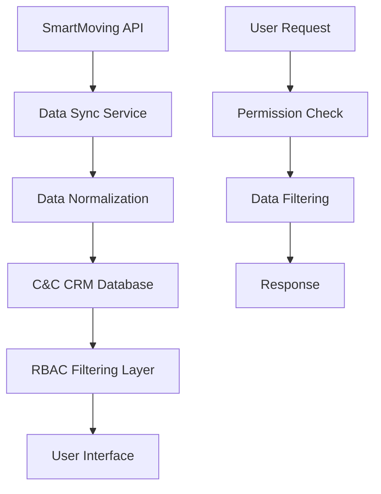

# 👥 **SMARTMOVING USER DATA ACCESS & JOB VIEWING PLAN**

**Date:** August 8, 2025  
**Status:** 📋 **ANALYSIS & PLANNING**  
**Version:** 1.0.0  

---

## 🎯 **OBJECTIVE**

Design and implement user-specific data access patterns for SmartMoving integration, enabling different user roles to view Let's Get Moving data based on their permissions, with special focus on viewing all locations and today's jobs.

---

## 🔍 **CURRENT RBAC SYSTEM ANALYSIS**

### **🏗️ User Role Hierarchy**
```
SUPER_ADMIN (System-wide)
├── ADMIN (Company-wide)
│   ├── MANAGER (Location oversight)
│   ├── DISPATCHER (Journey management)
│   ├── DRIVER (Field operations)
│   ├── MOVER (Field operations)
│   ├── AUDITOR (Compliance)
│   └── STORAGE_MANAGER (Storage operations)
```

### **📊 Current Data Access Patterns**

| **Role** | **SmartMoving Data Access** | **Location Scope** | **Job Access** | **Interface** |
|----------|----------------------------|-------------------|----------------|---------------|
| **SUPER_ADMIN** | ✅ All companies, all data | All 50+ locations | All jobs across system | Super Admin Portal |
| **ADMIN** | ✅ Company-wide data | Company locations only | All company jobs | Desktop Management |
| **DISPATCHER** | ✅ Location-specific data | Assigned locations only | Location jobs only | Desktop Management |
| **DRIVER** | ❌ No direct access | Journey locations only | Own assigned jobs | Mobile Field Ops |
| **MOVER** | ❌ No direct access | Journey locations only | Own assigned jobs | Mobile Field Ops |
| **MANAGER** | ✅ Location oversight data | Assigned locations | Location jobs with oversight | Desktop Management |
| **AUDITOR** | ✅ Read-only all data | All locations (read-only) | All jobs (read-only) | Desktop Audit Portal |

---

## 🎯 **REQUIREMENTS ANALYSIS**

### **User Requirements:**
1. **View Let's Get Moving Data** - Access to SmartMoving information
2. **See All Locations** - View across multiple LGM locations
3. **View Today's Jobs** - Access to current day's jobs
4. **View Tomorrow's Jobs** - Access to next day's jobs
5. **Role-Based Filtering** - Data filtered by user permissions

### **Technical Requirements:**
1. **Real-time Data Sync** - Live SmartMoving data
2. **Date-based Filtering** - Today and tomorrow jobs
3. **Location-based Access** - Multi-location support
4. **RBAC Enforcement** - Role-based data filtering
5. **Mobile & Desktop Support** - Cross-platform access

---

## 🗄️ **DATA ACCESS ARCHITECTURE**

### **1. SmartMoving Data Integration**

#### **Data Flow:**


#### **Database Schema Extensions:**
```prisma
// Extend TruckJourney model for SmartMoving integration
model TruckJourney {
  // ... existing fields ...
  
  // SmartMoving Integration Fields
  externalId        String?   // SmartMoving job ID
  externalData      Json?     // Raw SmartMoving data
  smartmovingJobNumber String? // SmartMoving job number
  smartmovingQuoteNumber String? // SmartMoving quote number
  customerName      String?   // Customer name from SmartMoving
  customerPhone     String?   // Customer phone from SmartMoving
  customerEmail     String?   // Customer email from SmartMoving
  estimatedValue    Decimal?  @db.Decimal(10,2) // SmartMoving estimated value
  serviceType       String?   // SmartMoving service type
  moveSize          String?   // SmartMoving move size
  
  // Enhanced location support
  originAddress     String?   // Pickup address
  destinationAddress String?  // Delivery address
  jobAddresses      Json?     // Array of job addresses
  
  // Date and scheduling
  scheduledDate     DateTime? // SmartMoving scheduled date
  confirmed         Boolean   @default(false) // SmartMoving confirmation status
}

// Extend Location model for SmartMoving integration
model Location {
  // ... existing fields ...
  
  // SmartMoving Integration Fields
  externalId        String?   // SmartMoving branch ID
  externalData      Json?     // Raw SmartMoving data
  smartmovingName   String?   // SmartMoving branch name
  phoneNumber       String?   // Branch phone number
  isPrimary         Boolean   @default(false) // Primary branch flag
  country           String?   // Country (Canada/USA)
  provinceState     String?   // Province/State
  city              String?   // City
  fullAddress       String?   // Complete address
  street            String?   // Street address
  zipCode           String?   // Postal/ZIP code
  latitude          Float?    // GPS coordinates
  longitude         Float?    // GPS coordinates
}
```

### **2. RBAC Data Access Service**

#### **SmartMoving RBAC Service:**
```typescript
class SmartMovingRBACService {
  async getUserAccessibleData(user: User, dateRange: DateRange): Promise<{
    locations: Location[];
    jobs: TruckJourney[];
    permissions: UserPermissions;
  }> {
    const permissions = this.getUserPermissions(user);
    
    // Get accessible locations based on role
    const locations = await this.getAccessibleLocations(user, permissions);
    
    // Get accessible jobs based on role and date range
    const jobs = await this.getAccessibleJobs(user, permissions, dateRange);
    
    return { locations, jobs, permissions };
  }
  
  private getUserPermissions(user: User): UserPermissions {
    switch (user.role) {
      case 'SUPER_ADMIN':
        return {
          canViewAllLocations: true,
          canViewAllJobs: true,
          canViewAllCompanies: true,
          canEditJobs: true,
          canAssignCrew: true,
          canViewFinancialData: true
        };
      
      case 'ADMIN':
        return {
          canViewAllLocations: true, // Within company
          canViewAllJobs: true, // Within company
          canViewAllCompanies: false,
          canEditJobs: true,
          canAssignCrew: true,
          canViewFinancialData: true
        };
      
      case 'DISPATCHER':
        return {
          canViewAllLocations: false,
          canViewAllJobs: false,
          canViewAllCompanies: false,
          canEditJobs: true,
          canAssignCrew: true,
          canViewFinancialData: false
        };
      
      case 'MANAGER':
        return {
          canViewAllLocations: false,
          canViewAllJobs: false,
          canViewAllCompanies: false,
          canEditJobs: true,
          canAssignCrew: true,
          canViewFinancialData: true
        };
      
      case 'DRIVER':
      case 'MOVER':
        return {
          canViewAllLocations: false,
          canViewAllJobs: false,
          canViewAllCompanies: false,
          canEditJobs: false,
          canAssignCrew: false,
          canViewFinancialData: false
        };
      
      case 'AUDITOR':
        return {
          canViewAllLocations: true,
          canViewAllJobs: true,
          canViewAllCompanies: true,
          canEditJobs: false,
          canAssignCrew: false,
          canViewFinancialData: true
        };
      
      default:
        return {
          canViewAllLocations: false,
          canViewAllJobs: false,
          canViewAllCompanies: false,
          canEditJobs: false,
          canAssignCrew: false,
          canViewFinancialData: false
        };
    }
  }
}
```

---

## 👥 **USER-SPECIFIC DATA ACCESS PATTERNS**

### **1. SUPER_ADMIN - System-Wide Access**

#### **Data Access:**
- ✅ **All 50+ LGM Locations** across Canada and USA
- ✅ **All Jobs** from all locations
- ✅ **All Companies** and their data
- ✅ **Financial Data** and analytics
- ✅ **System Configuration** and settings

#### **Interface:**
```typescript
// Super Admin Dashboard
interface SuperAdminSmartMovingView {
  // Location Overview
  allLocations: Location[]; // 50+ locations
  locationStats: {
    totalLocations: number;
    activeLocations: number;
    countries: string[];
    regions: string[];
  };
  
  // Job Overview
  todayJobs: TruckJourney[]; // All today's jobs
  tomorrowJobs: TruckJourney[]; // All tomorrow's jobs
  jobStats: {
    totalJobs: number;
    completedJobs: number;
    pendingJobs: number;
    totalValue: number;
  };
  
  // Company Overview
  companies: Company[];
  companyStats: {
    totalCompanies: number;
    activeCompanies: number;
    totalRevenue: number;
  };
}
```

#### **Navigation:**
- `/super-admin/smartmoving/locations` - All LGM locations
- `/super-admin/smartmoving/jobs/today` - Today's jobs across all locations
- `/super-admin/smartmoving/jobs/tomorrow` - Tomorrow's jobs across all locations
- `/super-admin/smartmoving/analytics` - System-wide analytics

### **2. ADMIN - Company-Wide Access**

#### **Data Access:**
- ✅ **All Company Locations** (LGM locations only)
- ✅ **All Company Jobs** from assigned company
- ✅ **Company Financial Data**
- ✅ **User Management** within company

#### **Interface:**
```typescript
// Admin Dashboard
interface AdminSmartMovingView {
  // Company Locations
  companyLocations: Location[]; // LGM locations only
  locationStats: {
    totalLocations: number;
    activeLocations: number;
    regions: string[];
  };
  
  // Company Jobs
  todayJobs: TruckJourney[]; // Company today's jobs
  tomorrowJobs: TruckJourney[]; // Company tomorrow's jobs
  jobStats: {
    totalJobs: number;
    completedJobs: number;
    pendingJobs: number;
    companyRevenue: number;
  };
}
```

#### **Navigation:**
- `/admin/smartmoving/locations` - Company LGM locations
- `/admin/smartmoving/jobs/today` - Today's company jobs
- `/admin/smartmoving/jobs/tomorrow` - Tomorrow's company jobs
- `/admin/smartmoving/analytics` - Company analytics

### **3. DISPATCHER - Location-Specific Access**

#### **Data Access:**
- ✅ **Assigned Location(s)** only
- ✅ **Location Jobs** for assigned locations
- ✅ **Crew Assignment** capabilities
- ❌ **No Financial Data** access

#### **Interface:**
```typescript
// Dispatcher Dashboard
interface DispatcherSmartMovingView {
  // Assigned Locations
  assignedLocations: Location[]; // User's assigned locations
  locationStats: {
    totalLocations: number;
    activeJobs: number;
  };
  
  // Location Jobs
  todayJobs: TruckJourney[]; // Assigned location jobs
  tomorrowJobs: TruckJourney[]; // Assigned location jobs
  jobStats: {
    totalJobs: number;
    assignedJobs: number;
    unassignedJobs: number;
  };
  
  // Crew Management
  availableCrew: User[];
  crewAssignments: AssignedCrew[];
}
```

#### **Navigation:**
- `/dispatcher/smartmoving/locations` - Assigned locations
- `/dispatcher/smartmoving/jobs/today` - Today's location jobs
- `/dispatcher/smartmoving/jobs/tomorrow` - Tomorrow's location jobs
- `/dispatcher/smartmoving/crew` - Crew management

### **4. MANAGER - Location Oversight Access**

#### **Data Access:**
- ✅ **Assigned Location(s)** with oversight
- ✅ **Location Jobs** with management capabilities
- ✅ **Financial Data** for assigned locations
- ✅ **Team Performance** analytics

#### **Interface:**
```typescript
// Manager Dashboard
interface ManagerSmartMovingView {
  // Managed Locations
  managedLocations: Location[]; // Locations under management
  locationStats: {
    totalLocations: number;
    activeJobs: number;
    totalRevenue: number;
  };
  
  // Location Jobs
  todayJobs: TruckJourney[]; // Managed location jobs
  tomorrowJobs: TruckJourney[]; // Managed location jobs
  jobStats: {
    totalJobs: number;
    completedJobs: number;
    revenue: number;
    efficiency: number;
  };
  
  // Team Performance
  teamPerformance: {
    drivers: UserPerformance[];
    movers: UserPerformance[];
    efficiency: number;
  };
}
```

#### **Navigation:**
- `/manager/smartmoving/locations` - Managed locations
- `/manager/smartmoving/jobs/today` - Today's managed jobs
- `/manager/smartmoving/jobs/tomorrow` - Tomorrow's managed jobs
- `/manager/smartmoving/performance` - Team performance

### **5. DRIVER/MOVER - Field Operations Access**

#### **Data Access:**
- ❌ **No Direct SmartMoving Access**
- ✅ **Assigned Journey Data** only
- ✅ **Journey-specific Information**
- ❌ **No Location Overview**

#### **Interface:**
```typescript
// Driver/Mover Mobile Interface
interface FieldOpsSmartMovingView {
  // Assigned Journeys
  assignedJourneys: TruckJourney[]; // User's assigned journeys only
  currentJourney: TruckJourney | null;
  
  // Journey Details
  journeyDetails: {
    customerName: string;
    customerPhone: string;
    originAddress: string;
    destinationAddress: string;
    scheduledTime: string;
    estimatedDuration: number;
  };
  
  // Journey Actions
  journeyActions: {
    canStartJourney: boolean;
    canUpdateStatus: boolean;
    canUploadMedia: boolean;
    canCompleteJourney: boolean;
  };
}
```

#### **Navigation:**
- `/mobile/journey/current` - Current assigned journey
- `/mobile/journey/history` - Past assigned journeys
- `/mobile/journey/upcoming` - Upcoming assigned journeys

### **6. AUDITOR - Read-Only Access**

#### **Data Access:**
- ✅ **All Locations** (read-only)
- ✅ **All Jobs** (read-only)
- ✅ **All Companies** (read-only)
- ✅ **Financial Data** (read-only)
- ❌ **No Edit Capabilities**

#### **Interface:**
```typescript
// Auditor Dashboard
interface AuditorSmartMovingView {
  // All Locations (Read-Only)
  allLocations: Location[]; // All 50+ locations
  locationStats: {
    totalLocations: number;
    activeLocations: number;
    countries: string[];
  };
  
  // All Jobs (Read-Only)
  todayJobs: TruckJourney[]; // All today's jobs
  tomorrowJobs: TruckJourney[]; // All tomorrow's jobs
  jobStats: {
    totalJobs: number;
    completedJobs: number;
    pendingJobs: number;
    complianceScore: number;
  };
  
  // Audit Data
  auditLogs: AuditEntry[];
  complianceReports: ComplianceReport[];
}
```

#### **Navigation:**
- `/auditor/smartmoving/locations` - All locations (read-only)
- `/auditor/smartmoving/jobs/today` - Today's jobs (read-only)
- `/auditor/smartmoving/jobs/tomorrow` - Tomorrow's jobs (read-only)
- `/auditor/smartmoving/compliance` - Compliance reports

---

## 📅 **DATE-BASED JOB FILTERING**

### **1. Today's Jobs Filtering**

#### **Date Range Logic:**
```typescript
const getTodayJobs = (user: User, locations: string[]): Promise<TruckJourney[]> => {
  const today = new Date();
  const startOfDay = new Date(today.getFullYear(), today.getMonth(), today.getDate());
  const endOfDay = new Date(today.getFullYear(), today.getMonth(), today.getDate(), 23, 59, 59);
  
  return prisma.truckJourney.findMany({
    where: {
      locationId: { in: locations },
      date: {
        gte: startOfDay,
        lte: endOfDay
      },
      // Role-based filtering
      ...(user.role === 'DRIVER' || user.role === 'MOVER' ? {
        assignedCrew: {
          some: {
            userId: user.id
          }
        }
      } : {})
    },
    include: {
      location: true,
      assignedCrew: {
        include: {
          user: true
        }
      }
    }
  });
};
```

#### **SmartMoving Integration:**
```typescript
const getSmartMovingTodayJobs = async (user: User): Promise<TruckJourney[]> => {
  const today = new Date().toISOString().split('T')[0]; // YYYY-MM-DD format
  
  // Get accessible locations
  const locations = await getAccessibleLocations(user);
  
  // Pull from SmartMoving API
  const smartmovingJobs = await smartmovingAPI.getJobs({
    date: today,
    locationIds: locations.map(loc => loc.externalId)
  });
  
  // Filter by user permissions
  return filterJobsByUserPermissions(user, smartmovingJobs);
};
```

### **2. Tomorrow's Jobs Filtering**

#### **Date Range Logic:**
```typescript
const getTomorrowJobs = (user: User, locations: string[]): Promise<TruckJourney[]> => {
  const tomorrow = new Date();
  tomorrow.setDate(tomorrow.getDate() + 1);
  const startOfDay = new Date(tomorrow.getFullYear(), tomorrow.getMonth(), tomorrow.getDate());
  const endOfDay = new Date(tomorrow.getFullYear(), tomorrow.getMonth(), tomorrow.getDate(), 23, 59, 59);
  
  return prisma.truckJourney.findMany({
    where: {
      locationId: { in: locations },
      date: {
        gte: startOfDay,
        lte: endOfDay
      },
      // Role-based filtering
      ...(user.role === 'DRIVER' || user.role === 'MOVER' ? {
        assignedCrew: {
          some: {
            userId: user.id
          }
        }
      } : {})
    },
    include: {
      location: true,
      assignedCrew: {
        include: {
          user: true
        }
      }
    }
  });
};
```

---

## 🗺️ **LOCATION ACCESS PATTERNS**

### **1. Multi-Location Access**

#### **SUPER_ADMIN & AUDITOR:**
```typescript
// All 50+ LGM locations
const getAllLGMLocations = async (): Promise<Location[]> => {
  return prisma.location.findMany({
    where: {
      client: {
        name: {
          contains: "Let's Get Moving"
        }
      }
    },
    include: {
      client: true
    }
  });
};
```

#### **ADMIN:**
```typescript
// Company LGM locations only
const getCompanyLGMLocations = async (clientId: string): Promise<Location[]> => {
  return prisma.location.findMany({
    where: {
      clientId: clientId,
      client: {
        name: {
          contains: "Let's Get Moving"
        }
      }
    },
    include: {
      client: true
    }
  });
};
```

#### **DISPATCHER & MANAGER:**
```typescript
// Assigned locations only
const getAssignedLocations = async (userId: string): Promise<Location[]> => {
  const user = await prisma.user.findUnique({
    where: { id: userId },
    include: {
      location: true
    }
  });
  
  return [user.location];
};
```

### **2. Location Data Structure**

#### **SmartMoving Location Mapping:**
```typescript
interface SmartMovingLocation {
  id: string;
  name: string; // "CALGARY 🇨🇦 - Let's Get Moving"
  phone: string;
  isPrimary: boolean;
  dispatchLocation: {
    fullAddress: string;
    street: string;
    city: string;
    state: string;
    zip: string;
    latitude: number;
    longitude: number;
  };
}

// Map to C&C CRM Location
const mapSmartMovingToCCLocation = (smLocation: SmartMovingLocation): Location => ({
  id: `loc_sm_${smLocation.id}`,
  clientId: "clm_lgm_corp_001", // LGM Corporate client
  name: smLocation.name,
  externalId: smLocation.id,
  externalData: smLocation,
  phoneNumber: smLocation.phone,
  isPrimary: smLocation.isPrimary,
  country: smLocation.name.includes("🇨🇦") ? "Canada" : "United States",
  provinceState: smLocation.dispatchLocation.state,
  city: smLocation.dispatchLocation.city,
  fullAddress: smLocation.dispatchLocation.fullAddress,
  street: smLocation.dispatchLocation.street,
  zipCode: smLocation.dispatchLocation.zip,
  latitude: smLocation.dispatchLocation.latitude,
  longitude: smLocation.dispatchLocation.longitude
});
```

---

## 🚀 **IMPLEMENTATION PLAN**

### **Phase 1: Database Schema Updates**
1. **Extend TruckJourney Model** - Add SmartMoving integration fields
2. **Extend Location Model** - Add SmartMoving location fields
3. **Create Migration Scripts** - Database schema updates
4. **Update TypeScript Types** - Frontend type definitions

### **Phase 2: SmartMoving Integration Service**
1. **Create SmartMoving Service** - API integration service
2. **Implement Data Sync** - Real-time data synchronization
3. **Add RBAC Filtering** - Role-based data filtering
4. **Create Date Filtering** - Today/tomorrow job filtering

### **Phase 3: User Interface Updates**
1. **Update Navigation** - Add SmartMoving menu items
2. **Create Location Views** - Multi-location display
3. **Create Job Views** - Today/tomorrow job displays
4. **Add Role-Based UI** - Role-specific interfaces

### **Phase 4: Testing & Deployment**
1. **Unit Testing** - Service and component testing
2. **Integration Testing** - End-to-end testing
3. **User Acceptance Testing** - Role-based testing
4. **Production Deployment** - Live deployment

---

## 📋 **SUMMARY**

### **User Data Access Matrix:**

| **Role** | **LGM Data Access** | **All Locations** | **Today's Jobs** | **Tomorrow's Jobs** | **Interface** |
|----------|-------------------|-------------------|------------------|-------------------|---------------|
| **SUPER_ADMIN** | ✅ Full Access | ✅ All 50+ | ✅ All Jobs | ✅ All Jobs | Super Admin Portal |
| **ADMIN** | ✅ Company Access | ✅ Company Only | ✅ Company Jobs | ✅ Company Jobs | Desktop Management |
| **DISPATCHER** | ✅ Location Access | ❌ Assigned Only | ✅ Location Jobs | ✅ Location Jobs | Desktop Management |
| **DRIVER** | ❌ No Direct Access | ❌ Journey Only | ❌ Assigned Only | ❌ Assigned Only | Mobile Field Ops |
| **MOVER** | ❌ No Direct Access | ❌ Journey Only | ❌ Assigned Only | ❌ Assigned Only | Mobile Field Ops |
| **MANAGER** | ✅ Oversight Access | ❌ Managed Only | ✅ Managed Jobs | ✅ Managed Jobs | Desktop Management |
| **AUDITOR** | ✅ Read-Only Access | ✅ All 50+ | ✅ All Jobs | ✅ All Jobs | Desktop Audit Portal |

### **Key Features:**
- ✅ **Role-Based Data Access** - Users see only what they're authorized to see
- ✅ **Multi-Location Support** - Access to 50+ LGM locations
- ✅ **Date-Based Filtering** - Today and tomorrow job views
- ✅ **Real-Time Sync** - Live SmartMoving data integration
- ✅ **Cross-Platform Support** - Desktop and mobile interfaces
- ✅ **Security & RBAC** - Comprehensive access control

**This plan provides a complete framework for user-specific SmartMoving data access with proper RBAC enforcement and multi-location support!** 🎯
