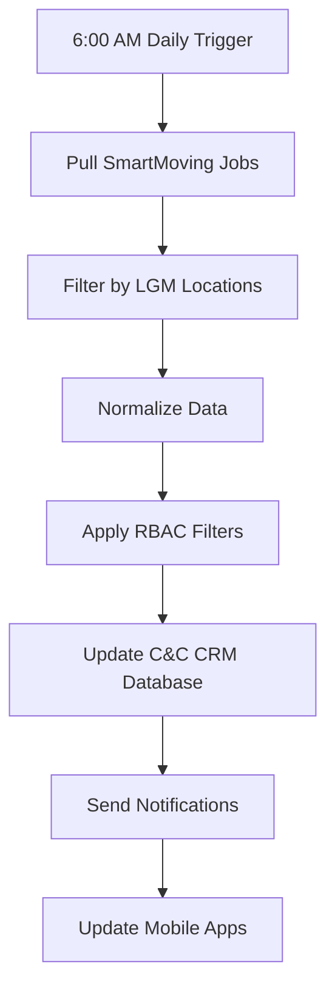
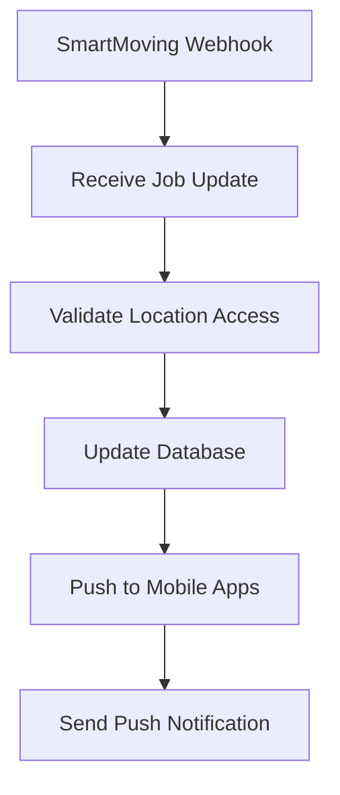

# 🔄 SmartMoving Data Normalization & Integration Plan

**Date:** August 8, 2025  
**Status:** ✅ **API CONNECTION VERIFIED**  
**Version:** 1.0.0  

---

## 🎯 **SUCCESSFUL DATA PULL SUMMARY**

### **✅ API Connection Verified**
- **API Key:** `185840176c73420fbd3a473c2fdccedb` ✅ Working
- **Base URL:** `https://api-public.smartmoving.com/v1` ✅ Working
- **Authentication:** `x-api-key` header ✅ Working
- **Sample Data:** Successfully pulled real LGM data

### **📊 Sample Data Retrieved**
- **Customer:** Aadil Amjid (Calgary, AB)
- **Opportunity:** #248238 (Single Item Move)
- **Job:** 248238-1 (Heavy Item +500lbs)
- **Branch:** CALGARY 🇨🇦 - Let's Get Moving
- **Estimated Total:** $1,179.15
- **Service Date:** 2025-08-07

---

## 🗄️ **DATA NORMALIZATION MAPPING**

### **SmartMoving → C&C CRM Schema Mapping**

| **SmartMoving Field** | **C&C CRM Model** | **C&C CRM Field** | **Data Type** | **Notes** |
|----------------------|-------------------|-------------------|---------------|-----------|
| `customer.id` | `Customer` | `externalId` | String | SmartMoving UUID |
| `customer.name` | `Customer` | `name` | String | Full name |
| `customer.emailAddress` | `Customer` | `email` | String | Primary email |
| `customer.phoneNumber` | `Customer` | `phone` | String | Primary phone |
| `customer.address` | `Customer` | `address` | String | Full address |
| `opportunity.id` | `Lead` | `externalId` | String | SmartMoving UUID |
| `opportunity.quoteNumber` | `Lead` | `quoteNumber` | String | Quote reference |
| `opportunity.status` | `Lead` | `status` | Enum | Mapped to LeadStatus |
| `opportunity.serviceDate` | `Lead` | `serviceDate` | Date | YYYYMMDD format |
| `opportunity.estimatedTotal.finalTotal` | `Lead` | `estimatedValue` | Decimal | Total value |
| `branch.name` | `Location` | `name` | String | Branch name |
| `branch.phoneNumber` | `Location` | `phone` | String | Branch phone |
| `jobs[].id` | `TruckJourney` | `externalId` | String | SmartMoving UUID |
| `jobs[].jobNumber` | `TruckJourney` | `journeyNumber` | String | Job reference |
| `jobs[].jobDate` | `TruckJourney` | `scheduledDate` | Date | Service date |
| `jobs[].type` | `TruckJourney` | `journeyType` | Enum | Mapped to JourneyType |
| `jobs[].confirmed` | `TruckJourney` | `isConfirmed` | Boolean | Confirmation status |
| `jobs[].jobAddresses[]` | `JourneyStep` | `address` | String | Origin/Destination |

---

## 🔧 **DATA TRANSFORMATION RULES**

### **1. Status Code Mapping**
```python
SMARTMOVING_STATUS_MAP = {
    3: "PENDING",      # Pending
    4: "CONFIRMED",    # Confirmed
    10: "IN_PROGRESS", # In Progress
    11: "COMPLETED",   # Completed
    30: "SCHEDULED"    # Scheduled
}
```

### **2. Job Type Mapping**
```python
SMARTMOVING_JOB_TYPE_MAP = {
    1: "FULL_SERVICE",     # Full Service Move
    12: "PARTIAL_MOVE",    # Partial Move
    # Add more mappings as discovered
}
```

### **3. Location Mapping**
```python
LGM_LOCATION_MAP = {
    "CALGARY 🇨🇦 - Let's Get Moving": "loc_lgm_calgary_001",
    "VANCOUVER 🇨🇦 - Let's Get Moving": "loc_lgm_vancouver_001",
    "BURNABY 🇨🇦 - Let's Get Moving": "loc_lgm_burnaby_corporate_001",
    # Add more LGM locations
}
```

### **4. Date Format Conversion**
```python
def convert_smartmoving_date(date_int: int) -> datetime:
    """Convert SmartMoving YYYYMMDD format to datetime"""
    date_str = str(date_int)
    return datetime.strptime(date_str, "%Y%m%d")
```

---

## 🏗️ **INTEGRATION ARCHITECTURE**

### **1. Data Pull Service**
```python
class SmartMovingDataService:
    async def pull_jobs_by_location_date(
        self, 
        location_name: str, 
        date: datetime
    ) -> List[Dict]:
        """Pull jobs for specific location and date"""
        
    async def normalize_job_data(
        self, 
        smartmoving_job: Dict
    ) -> Dict:
        """Normalize SmartMoving job to C&C CRM format"""
        
    async def sync_to_crm_database(
        self, 
        normalized_data: Dict
    ) -> bool:
        """Sync normalized data to C&C CRM database"""
```

### **2. RBAC Integration**
```python
class SmartMovingRBACService:
    async def filter_jobs_by_user_role(
        self, 
        user: User, 
        jobs: List[Dict]
    ) -> List[Dict]:
        """Filter jobs based on user role and permissions"""
        
    async def validate_location_access(
        self, 
        user: User, 
        location_id: str
    ) -> bool:
        """Validate user has access to specific location"""
```

### **3. Real-time Sync**
```python
class SmartMovingSyncService:
    async def schedule_daily_sync(self):
        """Schedule daily sync at 6 AM"""
        
    async def sync_pending_jobs(self):
        """Sync jobs that are pending/confirmed"""
        
    async def update_job_status(self, job_id: str):
        """Update job status in real-time"""
```

---

## 📱 **USER INTERFACE INTEGRATION**

### **1. Mobile Field Operations**
```typescript
// Mobile journey interface showing SmartMoving jobs
interface SmartMovingJob {
  id: string;
  jobNumber: string;
  customerName: string;
  serviceDate: string;
  originAddress: string;
  destinationAddress: string;
  estimatedValue: number;
  status: string;
  branch: string;
}

// Filter by location and date
const filterJobsByLocationDate = (
  jobs: SmartMovingJob[], 
  locationId: string, 
  date: string
) => {
  return jobs.filter(job => 
    job.branch === locationId && 
    job.serviceDate === date
  );
};
```

### **2. Dashboard Integration**
```typescript
// Dashboard showing today's jobs from SmartMoving
const TodayJobsWidget = () => {
  const [jobs, setJobs] = useState<SmartMovingJob[]>([]);
  const { user } = useAuth();
  
  useEffect(() => {
    // Fetch jobs for user's location and today's date
    fetchTodayJobs(user.locationId, new Date());
  }, [user]);
  
  return (
    <div className="today-jobs-widget">
      <h3>Today's Jobs ({jobs.length})</h3>
      {jobs.map(job => (
        <JobCard key={job.id} job={job} />
      ))}
    </div>
  );
};
```

---

## 🔄 **SYNC WORKFLOW**

### **1. Daily Sync Process**


### **2. Real-time Updates**


---

## 🛡️ **SECURITY & VALIDATION**

### **1. Data Validation**
```python
class SmartMovingDataValidator:
    def validate_customer_data(self, data: Dict) -> bool:
        """Validate customer data before import"""
        required_fields = ['name', 'email', 'phone']
        return all(field in data for field in required_fields)
    
    def validate_job_data(self, data: Dict) -> bool:
        """Validate job data before import"""
        required_fields = ['jobNumber', 'serviceDate', 'customer']
        return all(field in data for field in required_fields)
```

### **2. RBAC Enforcement**
```python
class SmartMovingRBACEnforcer:
    async def enforce_location_access(
        self, 
        user: User, 
        location_id: str
    ) -> bool:
        """Enforce location-based access control"""
        if user.role == "SUPER_ADMIN":
            return True
        
        return location_id in user.accessible_locations
    
    async def enforce_job_access(
        self, 
        user: User, 
        job: Dict
    ) -> bool:
        """Enforce job-level access control"""
        return await self.enforce_location_access(
            user, 
            job['branch']
        )
```

---

## 📊 **MONITORING & ANALYTICS**

### **1. Sync Metrics**
```python
class SmartMovingSyncMetrics:
    def track_sync_performance(self):
        """Track sync performance metrics"""
        metrics = {
            "jobs_synced": 0,
            "sync_duration": 0,
            "errors": 0,
            "last_sync": None
        }
        return metrics
    
    def generate_sync_report(self):
        """Generate daily sync report"""
        return {
            "date": datetime.now().date(),
            "total_jobs": 0,
            "successful_syncs": 0,
            "failed_syncs": 0,
            "locations_synced": []
        }
```

### **2. Data Quality Monitoring**
```python
class SmartMovingDataQualityMonitor:
    def check_data_completeness(self, jobs: List[Dict]) -> Dict:
        """Check data completeness for synced jobs"""
        return {
            "total_jobs": len(jobs),
            "complete_jobs": len([j for j in jobs if self.is_complete(j)]),
            "missing_customer_info": 0,
            "missing_address_info": 0
        }
    
    def is_complete(self, job: Dict) -> bool:
        """Check if job data is complete"""
        required_fields = ['customer', 'serviceDate', 'jobNumber']
        return all(field in job for field in required_fields)
```

---

## 🚀 **IMPLEMENTATION PHASES**

### **Phase 1: Core Integration (Week 1)**
- [ ] Create SmartMoving data service
- [ ] Implement data normalization
- [ ] Set up basic sync functionality
- [ ] Test with sample data

### **Phase 2: RBAC Integration (Week 2)**
- [ ] Implement location-based filtering
- [ ] Add user role validation
- [ ] Create access control middleware
- [ ] Test with different user roles

### **Phase 3: UI Integration (Week 3)**
- [ ] Update mobile interface
- [ ] Add dashboard widgets
- [ ] Implement real-time updates
- [ ] Add push notifications

### **Phase 4: Production Deployment (Week 4)**
- [ ] Set up automated sync
- [ ] Add monitoring and alerts
- [ ] Performance optimization
- [ ] Production testing

---

## 📋 **NEXT STEPS**

1. **✅ API Connection Verified** - SmartMoving API working
2. **🔄 Data Structure Analyzed** - Sample data pulled successfully
3. **📋 Normalization Plan Created** - Mapping defined
4. **🛠️ Implementation Ready** - Ready to build integration

**Immediate Actions:**
- Create SmartMoving data service
- Implement data normalization functions
- Set up location-based filtering
- Test with LGM Burnaby location

---

**Status:** Ready for implementation  
**Priority:** High  
**Estimated Timeline:** 4 weeks  
**Dependencies:** None (API access confirmed)
