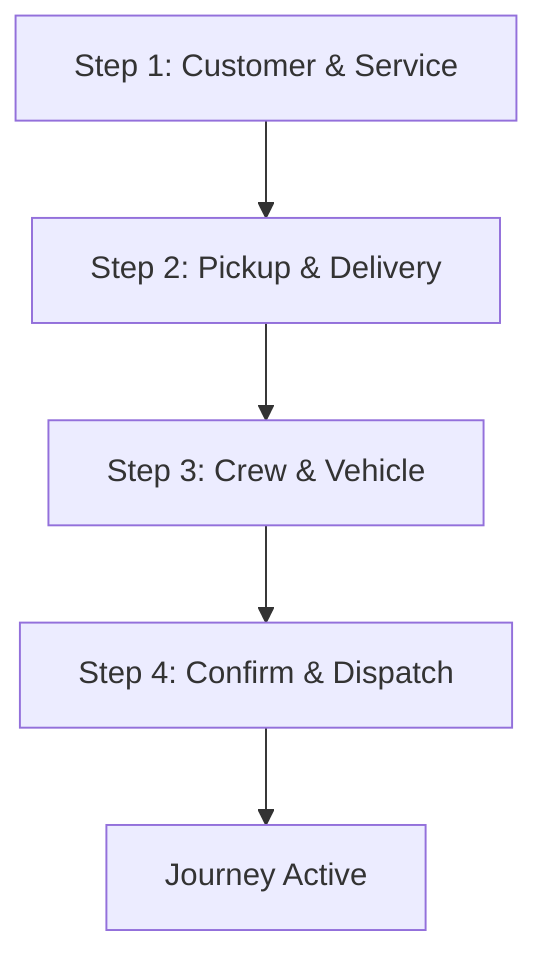

# 🚛 **TRUCK DISPATCHER 4-STEP JOURNEY**

**Project:** C&C CRM (Crate & Container Customer Relationship Management)  
**Version:** 2.6.0  
**Focus:** Simplified 4-Step Journey Flow for Truck Dispatchers  
**Last Updated:** January 2025  

---

## 🎯 **OVERVIEW**

This document outlines the **simplified 4-step journey flow** specifically designed for truck dispatchers. Each step is optimized for quick, efficient dispatch operations with minimal clicks and maximum productivity.

---

## 📋 **4-STEP JOURNEY FLOW**

### **🔄 Journey Flow Overview**



### **📊 Step Timeline**

| Step | Duration | Description | Key Actions |
|------|----------|-------------|-------------|
| **Step 1** | 2-3 min | Customer & Service | Customer info, service type, requirements |
| **Step 2** | 2-3 min | Pickup & Delivery | Addresses, dates, special instructions |
| **Step 3** | 1-2 min | Crew & Vehicle | Crew assignment, vehicle selection |
| **Step 4** | 1 min | Confirm & Dispatch | Final review, dispatch to crew |

**Total Time: 6-9 minutes per journey**

---

## 🚛 **STEP 1: CUSTOMER & SERVICE**

### **🎯 Objective**
Quickly capture customer information and service requirements.

### **📱 Interface Design**

#### **Desktop Interface**
```typescript
// Step 1: Customer & Service Form
{
  customerSection: {
    customerName: "text input (required)",
    phoneNumber: "phone input (required)",
    emailAddress: "email input (optional)",
    customerType: "dropdown: RESIDENTIAL | COMMERCIAL"
  },
  serviceSection: {
    serviceType: "dropdown: MOVE | DELIVERY | PICKUP | STORAGE",
    urgency: "dropdown: STANDARD | RUSH | URGENT",
    estimatedItems: "number input",
    specialRequirements: "textarea (optional)"
  },
  quickActions: {
    customerLookup: "search existing customers",
    serviceTemplates: "pre-built service types",
    autoPricing: "instant price calculation"
  }
}
```

#### **Mobile Interface (Dispatcher on the go)**
```typescript
// Mobile-optimized Step 1
{
  simplifiedForm: {
    customerName: "large text input",
    phoneNumber: "phone keypad",
    serviceType: "large buttons",
    urgency: "color-coded buttons"
  },
  voiceInput: {
    voiceToText: "speak customer info",
    autoFill: "smart suggestions"
  },
  quickTemplates: {
    commonServices: "one-tap selection",
    customerHistory: "previous services"
  }
}
```

### **⚡ Quick Actions**
- **Customer Lookup:** Search by name/phone
- **Service Templates:** Pre-built common services
- **Auto-Pricing:** Instant cost calculation
- **Voice Input:** Speak customer details

---

## 📍 **STEP 2: PICKUP & DELIVERY**

### **🎯 Objective**
Define pickup and delivery locations with scheduling.

### **📱 Interface Design**

#### **Desktop Interface**
```typescript
// Step 2: Pickup & Delivery Form
{
  pickupSection: {
    pickupAddress: "address input with autocomplete",
    pickupDate: "date picker",
    pickupTime: "time picker",
    pickupInstructions: "textarea",
    contactPerson: "text input"
  },
  deliverySection: {
    deliveryAddress: "address input with autocomplete",
    deliveryDate: "date picker",
    deliveryTime: "time picker",
    deliveryInstructions: "textarea",
    contactPerson: "text input"
  },
  routeOptimization: {
    distanceCalculation: "auto-calculated",
    estimatedTime: "auto-calculated",
    routePreview: "map preview",
    trafficConsideration: "real-time"
  }
}
```

#### **Mobile Interface**
```typescript
// Mobile-optimized Step 2
{
  locationInput: {
    addressAutocomplete: "smart suggestions",
    gpsLocation: "current location",
    recentAddresses: "quick selection",
    voiceAddress: "speak address"
  },
  scheduling: {
    datePicker: "large touch-friendly",
    timePicker: "quick time slots",
    durationEstimate: "auto-calculated"
  },
  routePreview: {
    mapView: "interactive map",
    distance: "prominent display",
    eta: "estimated arrival"
  }
}
```

### **⚡ Quick Actions**
- **Address Autocomplete:** Smart address suggestions
- **GPS Location:** Use current location
- **Recent Addresses:** Quick selection from history
- **Route Preview:** Instant map view
- **Voice Input:** Speak addresses

---

## 👷 **STEP 3: CREW & VEHICLE**

### **🎯 Objective**
Assign crew members and select appropriate vehicle.

### **📱 Interface Design**

#### **Desktop Interface**
```typescript
// Step 3: Crew & Vehicle Assignment
{
  crewSection: {
    driverSelection: "dropdown with availability",
    moverSelection: "multi-select with skills",
    crewSkills: "skill matrix display",
    availabilityCheck: "real-time calendar"
  },
  vehicleSection: {
    vehicleType: "dropdown: TRUCK_16FT | TRUCK_24FT | TRUCK_26FT",
    vehicleAvailability: "real-time status",
    equipmentNeeded: "checkboxes",
    specialEquipment: "text input"
  },
  smartAssignment: {
    autoSuggest: "AI-powered suggestions",
    skillMatching: "best crew for job",
    availabilityFilter: "only available crew",
    performanceRating: "crew ratings"
  }
}
```

#### **Mobile Interface**
```typescript
// Mobile-optimized Step 3
{
  crewSelection: {
    availableCrew: "large touch cards",
    skillIcons: "visual skill indicators",
    availabilityStatus: "color-coded status",
    oneTapAssign: "quick assignment"
  },
  vehicleSelection: {
    vehicleCards: "visual vehicle selection",
    capacityInfo: "clear capacity display",
    availabilityStatus: "real-time status",
    equipmentList: "checklist view"
  },
  smartSuggestions: {
    recommendedCrew: "highlighted suggestions",
    bestVehicle: "auto-selected based on job",
    conflictWarnings: "schedule conflicts"
  }
}
```

### **⚡ Quick Actions**
- **Auto-Assignment:** AI-powered crew suggestions
- **Availability Filter:** Only show available crew
- **Skill Matching:** Best crew for specific job
- **One-Tap Assign:** Quick crew assignment
- **Conflict Detection:** Schedule conflict warnings

---

## ✅ **STEP 4: CONFIRM & DISPATCH**

### **🎯 Objective**
Final review and dispatch journey to crew.

### **📱 Interface Design**

#### **Desktop Interface**
```typescript
// Step 4: Confirm & Dispatch
{
  journeySummary: {
    customerInfo: "summary display",
    serviceDetails: "service summary",
    locations: "pickup/delivery summary",
    crewAssignment: "crew summary",
    pricing: "cost breakdown"
  },
  dispatchActions: {
    sendToCrew: "dispatch button",
    sendToCustomer: "customer notification",
    printDocuments: "print option",
    saveTemplate: "save as template"
  },
  confirmation: {
    journeyId: "auto-generated ID",
    dispatchTime: "timestamp",
    crewNotifications: "notification status",
    customerNotifications: "notification status"
  }
}
```

#### **Mobile Interface**
```typescript
// Mobile-optimized Step 4
{
  summaryView: {
    compactSummary: "key information only",
    expandableDetails: "tap to expand",
    visualConfirmation: "checkmarks for completion"
  },
  dispatchActions: {
    largeDispatchButton: "prominent dispatch button",
    quickNotifications: "one-tap notifications",
    shareJourney: "share journey details"
  },
  confirmation: {
    successAnimation: "visual confirmation",
    journeyId: "large display",
    nextActions: "what happens next"
  }
}
```

### **⚡ Quick Actions**
- **One-Click Dispatch:** Single button to dispatch
- **Auto-Notifications:** Automatic crew and customer notifications
- **Journey Sharing:** Share journey details
- **Template Save:** Save as reusable template
- **Quick Print:** Print journey documents

---

## 📱 **MOBILE OPTIMIZATION**

### **🎯 Mobile-First Design Principles**

#### **1. Touch-Friendly Interface**
```typescript
// Mobile interface requirements
{
  touchTargets: {
    minimumSize: "44px x 44px",
    spacing: "8px minimum",
    visualFeedback: "touch animations"
  },
  navigation: {
    swipeGestures: "swipe between steps",
    backButton: "large back button",
    progressIndicator: "visual progress"
  },
  inputOptimization: {
    largeInputs: "easy to tap",
    voiceInput: "speak instead of type",
    autoComplete: "reduce typing"
  }
}
```

#### **2. Offline Capability**
```typescript
// Offline functionality
{
  offlineStorage: {
    formData: "auto-save progress",
    customerData: "cached customer info",
    crewData: "cached crew availability",
    syncOnReconnect: "automatic sync"
  },
  offlineActions: {
    createJourney: "create offline",
    assignCrew: "assign offline",
    sendNotifications: "queue for later"
  }
}
```

#### **3. Performance Optimization**
```typescript
// Performance features
{
  fastLoading: {
    lazyLoading: "load as needed",
    imageOptimization: "compressed images",
    caching: "smart caching"
  },
  batteryOptimization: {
    backgroundSync: "efficient sync",
    locationServices: "optimized GPS",
    pushNotifications: "batched notifications"
  }
}
```

---

## 🚀 **QUICK DISPATCH FEATURES**

### **⚡ Speed Optimizations**

#### **1. Smart Templates**
```typescript
// Journey templates
{
  commonServices: {
    residentialMove: "pre-filled residential move",
    commercialDelivery: "pre-filled commercial delivery",
    storagePickup: "pre-filled storage pickup",
    customTemplate: "user-defined templates"
  },
  quickAccess: {
    recentCustomers: "last 10 customers",
    frequentAddresses: "common addresses",
    favoriteCrew: "preferred crew combinations"
  }
}
```

#### **2. Auto-Fill Intelligence**
```typescript
// Auto-fill features
{
  customerAutoFill: {
    phoneLookup: "find customer by phone",
    emailLookup: "find customer by email",
    addressHistory: "previous addresses",
    serviceHistory: "previous services"
  },
  smartDefaults: {
    defaultCrew: "usual crew for service type",
    defaultVehicle: "usual vehicle for service type",
    defaultPricing: "usual pricing for service type"
  }
}
```

#### **3. One-Click Actions**
```typescript
// One-click features
{
  quickDispatch: {
    singleButton: "dispatch entire journey",
    autoNotifications: "crew and customer alerts",
    autoScheduling: "add to crew calendar",
    autoDocumentation: "generate journey documents"
  },
  quickModifications: {
    changeCrew: "one-click crew change",
    changeVehicle: "one-click vehicle change",
    reschedule: "one-click reschedule",
    cancel: "one-click cancellation"
  }
}
```

---

## 📊 **PERFORMANCE METRICS**

### **🎯 Dispatcher Efficiency KPIs**

#### **📈 Speed Metrics**
```typescript
// Speed performance metrics
{
  journeyCreation: {
    averageTime: "target: 6-9 minutes",
    fastestTime: "record: 3 minutes",
    stepBreakdown: "time per step",
    bottlenecks: "slowest steps"
  },
  dispatchEfficiency: {
    journeysPerHour: "target: 8-10 journeys/hour",
    errorRate: "target: <2% errors",
    customerSatisfaction: "target: >95% satisfaction",
    crewAcceptance: "target: >98% acceptance"
  }
}
```

#### **📱 Mobile Performance**
```typescript
// Mobile performance metrics
{
  appPerformance: {
    loadTime: "target: <2 seconds",
    responseTime: "target: <500ms",
    crashRate: "target: <1% crashes",
    batteryUsage: "target: <5% per hour"
  },
  userExperience: {
    taskCompletion: "target: >95% completion",
    userSatisfaction: "target: >4.5/5 rating",
    featureAdoption: "target: >80% adoption",
    supportRequests: "target: <5% need support"
  }
}
```

---

## 🔧 **IMPLEMENTATION CHECKLIST**

### **✅ 4-Step Journey Implementation**

#### **1. Step 1: Customer & Service**
- [ ] **Customer form** with auto-fill
- [ ] **Service type selection** with templates
- [ ] **Quick pricing** calculation
- [ ] **Voice input** capability
- [ ] **Customer lookup** functionality

#### **2. Step 2: Pickup & Delivery**
- [ ] **Address autocomplete** with GPS
- [ ] **Date/time pickers** optimized for mobile
- [ ] **Route optimization** with real-time traffic
- [ ] **Distance calculation** auto-updating
- [ ] **Voice address input**

#### **3. Step 3: Crew & Vehicle**
- [ ] **Crew availability** real-time display
- [ ] **Smart assignment** suggestions
- [ ] **Vehicle selection** with capacity info
- [ ] **Skill matching** algorithm
- [ ] **Conflict detection** warnings

#### **4. Step 4: Confirm & Dispatch**
- [ ] **Journey summary** with key details
- [ ] **One-click dispatch** functionality
- [ ] **Auto-notifications** to crew and customer
- [ ] **Template saving** capability
- [ ] **Success confirmation** with next steps

#### **5. Mobile Optimization**
- [ ] **Touch-friendly** interface design
- [ ] **Offline capability** for all steps
- [ ] **Performance optimization** for speed
- [ ] **Battery optimization** for field use
- [ ] **Voice commands** for hands-free operation

---

## 🎯 **CURRENT JOURNEY URLs**

### **📱 Journey Management URLs**

#### **Main Journey Pages:**
- **Journey List:** `http://localhost:3000/journeys` - View all journeys
- **Journey Create:** `http://localhost:3000/journey/create` - 4-step creation wizard
- **Journey Detail:** `http://localhost:3000/journey/[id]` - Individual journey details

#### **Mobile Journey Pages:**
- **Mobile Dashboard:** `http://localhost:3000/mobile` - Mobile field operations
- **Mobile Journey:** `http://localhost:3000/mobile/journey` - Mobile journey interface

#### **Super Admin Journey Pages:**
- **Super Admin Journeys:** `http://localhost:3000/super-admin/journeys` - Cross-company journey management

### **🚛 Dispatcher-Specific URLs**

#### **Dispatcher Dashboard:**
- **Operations Dashboard:** `http://localhost:3000/dashboard` - Main dispatcher dashboard
- **Journey Management:** `http://localhost:3000/journeys` - Journey list and management
- **Journey Creation:** `http://localhost:3000/journey/create` - 4-step journey creation
- **Crew Management:** `http://localhost:3000/crew` - Crew assignment and management
- **Dispatch Center:** `http://localhost:3000/dispatch` - Active journey monitoring

---

**🎯 This 4-step journey flow is specifically designed for truck dispatchers to create and dispatch journeys quickly and efficiently. The mobile-first approach ensures dispatchers can work effectively from any device, with offline capability for field operations and voice input for hands-free operation.** 