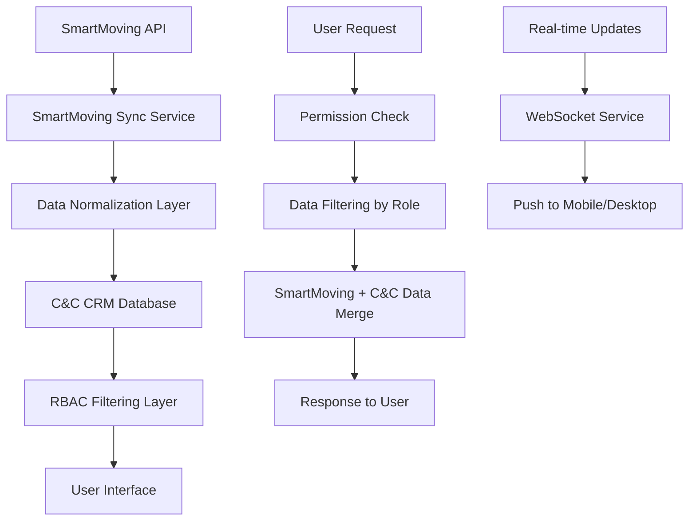

# 🔄 **SMARTMOVING JOURNEY INTEGRATION IMPLEMENTATION PLAN**

**Project:** C&C CRM - SmartMoving Integration  
**Implementation Date:** August 2025  
**Version:** 1.0.0  
**Status:** 📋 **COMPREHENSIVE IMPLEMENTATION PLAN**

---

## 🎯 **EXECUTIVE SUMMARY**

This plan outlines the complete integration of **SmartMoving job data** into the existing C&C CRM journey workflow system. The integration will enable users to view and manage SmartMoving jobs (today and tomorrow) within the existing RBAC framework, with role-specific access patterns and seamless integration into the current 6-phase journey workflow.

---

## 🏗️ **INTEGRATION ARCHITECTURE**

### **🔄 SmartMoving + C&C CRM Unified Architecture**

```typescript
// Unified data architecture with SmartMoving integration
{
  databaseSchema: {
    // Enhanced TruckJourney with SmartMoving data
    TruckJourney: {
      // Existing C&C CRM fields
      id: "jour_001",
      status: "EN_ROUTE",
      currentPhase: "TRANSPORT",
      progress: 60,
      
      // NEW: SmartMoving Integration Fields
      externalId: "sm_job_248238_1",           // SmartMoving job ID
      externalData: {                          // Raw SmartMoving data
        smartmovingJobNumber: "248238-1",
        smartmovingQuoteNumber: "248238",
        customerName: "Aadil Amjid",
        customerPhone: "4039189192",
        customerEmail: "Aadilamjid8@gmail.com",
        estimatedValue: 1179.15,
        serviceType: "Single Item Move",
        moveSize: "Heavy Item +500lbs",
        jobAddresses: [
          "95 Millrose Place SW, Calgary, Alberta T2Y 2P3, Canada",
          "1812 Palliser Drive SW, Calgary, Alberta T2V 4K9, Canada"
        ]
      },
      
      // Enhanced location support
      originAddress: "95 Millrose Place SW, Calgary, Alberta T2Y 2P3, Canada",
      destinationAddress: "1812 Palliser Drive SW, Calgary, Alberta T2V 4K9, Canada",
      scheduledDate: "2025-08-07T00:00:00Z",
      confirmed: true,
      
      // Data source tracking
      dataSource: "SMARTMOVING",               // SMARTMOVING or MANUAL
      lastSyncAt: "2025-08-07T06:00:00Z",
      syncStatus: "SYNCED"                     // SYNCED, PENDING, FAILED
    },
    
    // Enhanced Location with SmartMoving data
    Location: {
      // Existing fields
      id: "loc_calgary_001",
      name: "CALGARY",
      
      // NEW: SmartMoving Integration Fields
      externalId: "sm_branch_calgary",         // SmartMoving branch ID
      externalData: {                          // Raw SmartMoving data
        smartmovingName: "CALGARY 🇨🇦 - Let's Get Moving",
        phoneNumber: "(587) 430-3006",
        isPrimary: false,
        country: "Canada",
        provinceState: "Alberta",
        city: "Calgary",
        fullAddress: "32615 South Fraser Way, Calgary, Alberta T2T 1X8, Canada",
        latitude: 49.051584,
        longitude: -122.320611
      },
      
      // Data source tracking
      dataSource: "SMARTMOVING",
      lastSyncAt: "2025-08-07T06:00:00Z"
    }
  }
}
```

### **📊 Data Flow Architecture**



---

## 👥 **USER ROLE INTEGRATION MATRIX**

### **📊 SmartMoving Data Access by Role**

| **Role** | **SmartMoving Jobs** | **All Locations** | **Today's Jobs** | **Tomorrow's Jobs** | **Interface Integration** |
|----------|---------------------|-------------------|------------------|-------------------|---------------------------|
| **SUPER_ADMIN** | ✅ All Jobs | ✅ All 50+ | ✅ All Jobs | ✅ All Jobs | Super Admin Portal |
| **ADMIN** | ✅ Company Jobs | ✅ Company Only | ✅ Company Jobs | ✅ Company Jobs | Desktop Management |
| **DISPATCHER** | ✅ Location Jobs | ❌ Assigned Only | ✅ Location Jobs | ✅ Location Jobs | Desktop Management |
| **DRIVER** | ❌ No Direct Access | ❌ Journey Only | ❌ Assigned Only | ❌ Assigned Only | Mobile Field Ops |
| **MOVER** | ❌ No Direct Access | ❌ Journey Only | ❌ Assigned Only | ❌ Assigned Only | Mobile Field Ops |
| **MANAGER** | ✅ Managed Jobs | ❌ Managed Only | ✅ Managed Jobs | ✅ Managed Jobs | Desktop Management |
| **AUDITOR** | ✅ Read-Only All | ✅ All 50+ | ✅ All Jobs | ✅ All Jobs | Desktop Audit Portal |

### **🎯 Role-Specific SmartMoving Integration**

#### **SUPER_ADMIN Integration**
```typescript
// Super Admin SmartMoving Dashboard
{
  superAdminSmartMovingView: {
    // Location Overview
    allLocations: Location[], // 50+ LGM locations
    locationStats: {
      totalLocations: 50,
      activeLocations: 43,
      countries: ["Canada", "United States"],
      regions: ["Western Canada", "Eastern Canada", "USA"]
    },
    
    // Job Overview
    todayJobs: TruckJourney[], // All today's SmartMoving jobs
    tomorrowJobs: TruckJourney[], // All tomorrow's SmartMoving jobs
    jobStats: {
      totalJobs: 156,
      completedJobs: 89,
      pendingJobs: 67,
      totalValue: "$2.4M",
      smartmovingJobs: 134,
      manualJobs: 22
    },
    
    // Company Overview
    companies: Company[],
    companyStats: {
      totalCompanies: 1, // LGM Corporate
      activeCompanies: 1,
      totalRevenue: "$2.4M"
    }
  }
}
```

#### **ADMIN Integration**
```typescript
// Admin SmartMoving Dashboard
{
  adminSmartMovingView: {
    // Company Locations
    companyLocations: Location[], // LGM locations only
    locationStats: {
      totalLocations: 50,
      activeLocations: 43,
      regions: ["Western Canada", "Eastern Canada", "USA"]
    },
    
    // Company Jobs
    todayJobs: TruckJourney[], // Company today's jobs
    tomorrowJobs: TruckJourney[], // Company tomorrow's jobs
    jobStats: {
      totalJobs: 156,
      completedJobs: 89,
      pendingJobs: 67,
      companyRevenue: "$2.4M",
      smartmovingJobs: 134,
      manualJobs: 22
    }
  }
}
```

#### **DISPATCHER Integration**
```typescript
// Dispatcher SmartMoving Dashboard
{
  dispatcherSmartMovingView: {
    // Assigned Locations
    assignedLocations: Location[], // User's assigned locations
    locationStats: {
      totalLocations: 3, // Assigned locations only
      activeJobs: 8
    },
    
    // Location Jobs
    todayJobs: TruckJourney[], // Assigned location jobs
    tomorrowJobs: TruckJourney[], // Assigned location jobs
    jobStats: {
      totalJobs: 12,
      assignedJobs: 8,
      unassignedJobs: 4,
      smartmovingJobs: 10,
      manualJobs: 2
    },
    
    // Crew Management
    availableCrew: User[],
    crewAssignments: AssignedCrew[]
  }
}
```

---

## 📅 **DATE-BASED JOB FILTERING IMPLEMENTATION**

### **🎯 Today's Jobs Filtering**

#### **Database Query Implementation**
```sql
-- Get today's jobs with SmartMoving integration
SELECT 
    j.*,
    l.name as location_name,
    l.externalData->>'smartmovingName' as smartmoving_location_name,
    j.externalData->>'smartmovingJobNumber' as smartmoving_job_number,
    j.externalData->>'customerName' as customer_name,
    j.externalData->>'estimatedValue' as estimated_value,
    j.dataSource,
    j.lastSyncAt
FROM "TruckJourney" j
JOIN "Location" l ON j.locationId = l.id
WHERE 
    j.date >= CURRENT_DATE 
    AND j.date < CURRENT_DATE + INTERVAL '1 day'
    AND j.clientId = :client_id
    AND (
        :user_role = 'SUPER_ADMIN' 
        OR (:user_role = 'ADMIN' AND j.clientId = :client_id)
        OR (:user_role = 'DISPATCHER' AND j.locationId = :location_id)
        OR (:user_role = 'MANAGER' AND j.locationId IN :managed_locations)
        OR (:user_role = 'AUDITOR')
    )
ORDER BY j.date ASC, j.createdAt ASC;
```

#### **API Endpoint Implementation**
```typescript
// SmartMoving Jobs API
@router.get("/smartmoving/jobs/today")
async def get_smartmoving_today_jobs(
    current_user: dict = Depends(get_current_user),
    tenant_info: dict = Depends(get_tenant_context),
    db = Depends(get_database_connection)
):
    """Get today's SmartMoving jobs based on user role"""
    
    # Get user permissions
    user_permissions = get_user_smartmoving_permissions(current_user)
    
    # Build query based on role
    query = build_smartmoving_jobs_query(
        user=current_user,
        date_filter="today",
        permissions=user_permissions
    )
    
    # Execute query
    jobs = await db.fetch_all(query)
    
    # Format response
    return {
        "success": True,
        "data": {
            "jobs": format_smartmoving_jobs(jobs),
            "stats": calculate_job_stats(jobs),
            "filters": {
                "date": "today",
                "dataSource": "SMARTMOVING",
                "userRole": current_user["role"]
            }
        }
    }
```

### **🎯 Tomorrow's Jobs Filtering**

#### **Database Query Implementation**
```sql
-- Get tomorrow's jobs with SmartMoving integration
SELECT 
    j.*,
    l.name as location_name,
    l.externalData->>'smartmovingName' as smartmoving_location_name,
    j.externalData->>'smartmovingJobNumber' as smartmoving_job_number,
    j.externalData->>'customerName' as customer_name,
    j.externalData->>'estimatedValue' as estimated_value,
    j.dataSource,
    j.lastSyncAt
FROM "TruckJourney" j
JOIN "Location" l ON j.locationId = l.id
WHERE 
    j.date >= CURRENT_DATE + INTERVAL '1 day'
    AND j.date < CURRENT_DATE + INTERVAL '2 days'
    AND j.clientId = :client_id
    AND (
        :user_role = 'SUPER_ADMIN' 
        OR (:user_role = 'ADMIN' AND j.clientId = :client_id)
        OR (:user_role = 'DISPATCHER' AND j.locationId = :location_id)
        OR (:user_role = 'MANAGER' AND j.locationId IN :managed_locations)
        OR (:user_role = 'AUDITOR')
    )
ORDER BY j.date ASC, j.createdAt ASC;
```

---

## 🔄 **SMARTMOVING SYNC SERVICE IMPLEMENTATION**

### **📊 SmartMoving Data Sync Service**

```typescript
class SmartMovingSyncService {
  async sync_today_and_tomorrow_jobs(): Promise<SyncResult> {
    const today = new Date();
    const tomorrow = new Date(today);
    tomorrow.setDate(tomorrow.getDate() + 1);
    
    const syncResults = {
      today: await this.sync_jobs_for_date(today),
      tomorrow: await this.sync_jobs_for_date(tomorrow),
      summary: {
        totalProcessed: 0,
        totalCreated: 0,
        totalUpdated: 0,
        totalFailed: 0
      }
    };
    
    // Calculate summary
    syncResults.summary.totalProcessed = 
      syncResults.today.processed + syncResults.tomorrow.processed;
    syncResults.summary.totalCreated = 
      syncResults.today.created + syncResults.tomorrow.created;
    syncResults.summary.totalUpdated = 
      syncResults.today.updated + syncResults.tomorrow.updated;
    syncResults.summary.totalFailed = 
      syncResults.today.failed + syncResults.tomorrow.failed;
    
    return syncResults;
  }
  
  async sync_jobs_for_date(date: Date): Promise<DateSyncResult> {
    const dateStr = date.toISOString().split('T')[0]; // YYYY-MM-DD
    
    // Pull SmartMoving jobs for date
    const smartmovingJobs = await this.pull_smartmoving_jobs(dateStr);
    
    // Normalize SmartMoving data to C&C CRM format
    const normalizedJobs = this.normalize_smartmoving_jobs(smartmovingJobs);
    
    // Sync to C&C CRM database
    const syncResult = await this.sync_to_crm_database(normalizedJobs, dateStr);
    
    return syncResult;
  }
  
  private normalize_smartmoving_jobs(smartmovingJobs: any[]): TruckJourney[] {
    return smartmovingJobs.map(job => ({
      // Map SmartMoving job to C&C CRM TruckJourney
      externalId: job.id,
      externalData: job,
      smartmovingJobNumber: job.jobNumber,
      smartmovingQuoteNumber: job.quoteNumber,
      customerName: job.customer?.name,
      customerPhone: job.customer?.phoneNumber,
      customerEmail: job.customer?.emailAddress,
      estimatedValue: job.estimatedTotal?.finalTotal,
      serviceType: job.serviceType,
      moveSize: job.moveSize,
      originAddress: job.jobAddresses?.[0],
      destinationAddress: job.jobAddresses?.[1],
      scheduledDate: this.convert_smartmoving_date(job.jobDate),
      confirmed: job.confirmed,
      dataSource: "SMARTMOVING",
      lastSyncAt: new Date(),
      syncStatus: "SYNCED"
    }));
  }
}
```

### **🔄 Real-time Sync Implementation**

```typescript
// Real-time SmartMoving sync
class SmartMovingRealTimeSync {
  async start_real_time_sync(): Promise<void> {
    // Schedule daily sync at 6 AM
    cron.schedule('0 6 * * *', async () => {
      await this.sync_today_and_tomorrow_jobs();
    });
    
    // Real-time updates via webhooks
    this.setup_smartmoving_webhooks();
  }
  
  private setup_smartmoving_webhooks(): void {
    // Configure SmartMoving webhooks for real-time updates
    const webhookConfig = {
      url: `${process.env.API_BASE_URL}/smartmoving/webhooks`,
      events: [
        'job.created',
        'job.updated', 
        'job.completed',
        'job.cancelled'
      ]
    };
    
    // Register webhook with SmartMoving
    this.register_smartmoving_webhook(webhookConfig);
  }
  
  async handle_smartmoving_webhook(payload: any): Promise<void> {
    // Handle real-time SmartMoving updates
    const { event, data } = payload;
    
    switch (event) {
      case 'job.created':
      case 'job.updated':
        await this.update_job_in_crm(data);
        break;
      case 'job.completed':
        await this.complete_job_in_crm(data);
        break;
      case 'job.cancelled':
        await this.cancel_job_in_crm(data);
        break;
    }
  }
}
```

---

## 🎨 **ROLE-SPECIFIC UI COMPONENTS**

### **📱 SmartMoving Dashboard Components**

#### **SUPER_ADMIN SmartMoving Dashboard**
```typescript
// Super Admin SmartMoving Dashboard Component
const SuperAdminSmartMovingDashboard = () => {
  const [todayJobs, setTodayJobs] = useState<TruckJourney[]>([]);
  const [tomorrowJobs, setTomorrowJobs] = useState<TruckJourney[]>([]);
  const [allLocations, setAllLocations] = useState<Location[]>([]);
  
  useEffect(() => {
    // Fetch SmartMoving data for super admin
    fetchSuperAdminSmartMovingData();
  }, []);
  
  return (
    <div className="super-admin-smartmoving-dashboard">
      {/* Location Overview */}
      <SmartMovingLocationOverview 
        locations={allLocations}
        stats={locationStats}
      />
      
      {/* Today's Jobs */}
      <SmartMovingJobsSection
        title="Today's SmartMoving Jobs"
        jobs={todayJobs}
        dateFilter="today"
        showAllLocations={true}
      />
      
      {/* Tomorrow's Jobs */}
      <SmartMovingJobsSection
        title="Tomorrow's SmartMoving Jobs"
        jobs={tomorrowJobs}
        dateFilter="tomorrow"
        showAllLocations={true}
      />
      
      {/* System Analytics */}
      <SmartMovingSystemAnalytics />
    </div>
  );
};
```

#### **ADMIN SmartMoving Dashboard**
```typescript
// Admin SmartMoving Dashboard Component
const AdminSmartMovingDashboard = () => {
  const [companyJobs, setCompanyJobs] = useState<TruckJourney[]>([]);
  const [companyLocations, setCompanyLocations] = useState<Location[]>([]);
  
  useEffect(() => {
    // Fetch SmartMoving data for admin (company only)
    fetchAdminSmartMovingData();
  }, []);
  
  return (
    <div className="admin-smartmoving-dashboard">
      {/* Company Locations */}
      <SmartMovingCompanyLocations 
        locations={companyLocations}
        stats={companyLocationStats}
      />
      
      {/* Company Jobs */}
      <SmartMovingJobsSection
        title="Company SmartMoving Jobs"
        jobs={companyJobs}
        dateFilter="today"
        showAllLocations={false}
      />
      
      {/* Company Analytics */}
      <SmartMovingCompanyAnalytics />
    </div>
  );
};
```

#### **DISPATCHER SmartMoving Dashboard**
```typescript
// Dispatcher SmartMoving Dashboard Component
const DispatcherSmartMovingDashboard = () => {
  const [locationJobs, setLocationJobs] = useState<TruckJourney[]>([]);
  const [assignedLocations, setAssignedLocations] = useState<Location[]>([]);
  
  useEffect(() => {
    // Fetch SmartMoving data for dispatcher (assigned locations only)
    fetchDispatcherSmartMovingData();
  }, []);
  
  return (
    <div className="dispatcher-smartmoving-dashboard">
      {/* Assigned Locations */}
      <SmartMovingAssignedLocations 
        locations={assignedLocations}
        stats={assignedLocationStats}
      />
      
      {/* Location Jobs */}
      <SmartMovingJobsSection
        title="Location SmartMoving Jobs"
        jobs={locationJobs}
        dateFilter="today"
        showAllLocations={false}
      />
      
      {/* Crew Assignment */}
      <SmartMovingCrewAssignment />
    </div>
  );
};
```

### **📊 SmartMoving Job Cards**

```typescript
// SmartMoving Job Card Component
const SmartMovingJobCard = ({ job, userRole }: { job: TruckJourney, userRole: string }) => {
  const isSmartMovingJob = job.dataSource === "SMARTMOVING";
  
  return (
    <div className={`job-card ${isSmartMovingJob ? 'smartmoving-job' : 'manual-job'}`}>
      {/* Job Header */}
      <div className="job-header">
        <div className="job-id">
          {isSmartMovingJob ? (
            <>
              <span className="smartmoving-badge">SM</span>
              {job.externalData?.smartmovingJobNumber}
            </>
          ) : (
            job.id
          )}
        </div>
        <div className="job-status">{job.status}</div>
      </div>
      
      {/* Customer Information */}
      <div className="customer-info">
        <h3>{job.externalData?.customerName || job.customerName}</h3>
        <p>{job.externalData?.customerPhone || job.customerPhone}</p>
        <p>{job.externalData?.customerEmail || job.customerEmail}</p>
      </div>
      
      {/* Job Details */}
      <div className="job-details">
        <div className="addresses">
          <div className="pickup">
            <strong>Pickup:</strong> {job.originAddress}
          </div>
          <div className="delivery">
            <strong>Delivery:</strong> {job.destinationAddress}
          </div>
        </div>
        
        {isSmartMovingJob && (
          <div className="smartmoving-details">
            <div className="service-type">
              <strong>Service:</strong> {job.externalData?.serviceType}
            </div>
            <div className="move-size">
              <strong>Size:</strong> {job.externalData?.moveSize}
            </div>
            <div className="estimated-value">
              <strong>Est. Value:</strong> ${job.externalData?.estimatedValue}
            </div>
          </div>
        )}
      </div>
      
      {/* Job Actions */}
      <div className="job-actions">
        {userRole === 'DISPATCHER' && (
          <button onClick={() => assignCrew(job.id)}>
            Assign Crew
          </button>
        )}
        <button onClick={() => viewJobDetails(job.id)}>
          View Details
        </button>
      </div>
    </div>
  );
};
```

---

## 🔐 **RBAC ENFORCEMENT IMPLEMENTATION**

### **📊 Permission System**

```typescript
// SmartMoving RBAC Service
class SmartMovingRBACService {
  getUserSmartMovingPermissions(user: User): SmartMovingPermissions {
    switch (user.role) {
      case 'SUPER_ADMIN':
        return {
          canViewAllLocations: true,
          canViewAllJobs: true,
          canViewAllCompanies: true,
          canEditJobs: true,
          canAssignCrew: true,
          canViewFinancialData: true,
          canSyncData: true,
          canViewSmartMovingData: true
        };
      
      case 'ADMIN':
        return {
          canViewAllLocations: true, // Within company
          canViewAllJobs: true, // Within company
          canViewAllCompanies: false,
          canEditJobs: true,
          canAssignCrew: true,
          canViewFinancialData: true,
          canSyncData: false,
          canViewSmartMovingData: true
        };
      
      case 'DISPATCHER':
        return {
          canViewAllLocations: false,
          canViewAllJobs: false,
          canViewAllCompanies: false,
          canEditJobs: true,
          canAssignCrew: true,
          canViewFinancialData: false,
          canSyncData: false,
          canViewSmartMovingData: true
        };
      
      case 'MANAGER':
        return {
          canViewAllLocations: false,
          canViewAllJobs: false,
          canViewAllCompanies: false,
          canEditJobs: true,
          canAssignCrew: true,
          canViewFinancialData: true,
          canSyncData: false,
          canViewSmartMovingData: true
        };
      
      case 'DRIVER':
      case 'MOVER':
        return {
          canViewAllLocations: false,
          canViewAllJobs: false,
          canViewAllCompanies: false,
          canEditJobs: false,
          canAssignCrew: false,
          canViewFinancialData: false,
          canSyncData: false,
          canViewSmartMovingData: false // No direct access
        };
      
      case 'AUDITOR':
        return {
          canViewAllLocations: true,
          canViewAllJobs: true,
          canViewAllCompanies: true,
          canEditJobs: false,
          canAssignCrew: false,
          canViewFinancialData: true,
          canSyncData: false,
          canViewSmartMovingData: true
        };
      
      default:
        return {
          canViewAllLocations: false,
          canViewAllJobs: false,
          canViewAllCompanies: false,
          canEditJobs: false,
          canAssignCrew: false,
          canViewFinancialData: false,
          canSyncData: false,
          canViewSmartMovingData: false
        };
    }
  }
  
  async filterJobsByUserRole(
    user: User, 
    jobs: TruckJourney[]
  ): Promise<TruckJourney[]> {
    const permissions = this.getUserSmartMovingPermissions(user);
    
    if (!permissions.canViewSmartMovingData) {
      return []; // No SmartMoving access
    }
    
    return jobs.filter(job => {
      // Location-based filtering
      if (user.role === 'DISPATCHER') {
        return job.locationId === user.locationId;
      }
      
      if (user.role === 'MANAGER') {
        return user.managedLocations.includes(job.locationId);
      }
      
      if (user.role === 'ADMIN') {
        return job.clientId === user.clientId;
      }
      
      // SUPER_ADMIN and AUDITOR can see all jobs
      return true;
    });
  }
}
```

---

## 🚀 **IMPLEMENTATION PHASES**

### **PHASE 1: DATABASE SCHEMA UPDATES (Week 1)**

#### **1.1 Extend TruckJourney Model**
```sql
-- Add SmartMoving integration fields to TruckJourney
ALTER TABLE "TruckJourney" ADD COLUMN IF NOT EXISTS "externalId" TEXT;
ALTER TABLE "TruckJourney" ADD COLUMN IF NOT EXISTS "externalData" JSONB;
ALTER TABLE "TruckJourney" ADD COLUMN IF NOT EXISTS "dataSource" TEXT DEFAULT 'MANUAL';
ALTER TABLE "TruckJourney" ADD COLUMN IF NOT EXISTS "lastSyncAt" TIMESTAMP;
ALTER TABLE "TruckJourney" ADD COLUMN IF NOT EXISTS "syncStatus" TEXT DEFAULT 'SYNCED';

-- Add indexes for performance
CREATE INDEX IF NOT EXISTS "idx_truckjourney_externalid" ON "TruckJourney"("externalId");
CREATE INDEX IF NOT EXISTS "idx_truckjourney_datasource" ON "TruckJourney"("dataSource");
CREATE INDEX IF NOT EXISTS "idx_truckjourney_syncstatus" ON "TruckJourney"("syncStatus");
```

#### **1.2 Extend Location Model**
```sql
-- Add SmartMoving integration fields to Location
ALTER TABLE "Location" ADD COLUMN IF NOT EXISTS "externalId" TEXT;
ALTER TABLE "Location" ADD COLUMN IF NOT EXISTS "externalData" JSONB;
ALTER TABLE "Location" ADD COLUMN IF NOT EXISTS "dataSource" TEXT DEFAULT 'MANUAL';
ALTER TABLE "Location" ADD COLUMN IF NOT EXISTS "lastSyncAt" TIMESTAMP;

-- Add indexes for performance
CREATE INDEX IF NOT EXISTS "idx_location_externalid" ON "Location"("externalId");
CREATE INDEX IF NOT EXISTS "idx_location_datasource" ON "Location"("dataSource");
```

### **PHASE 2: SMARTMOVING SYNC SERVICE (Week 2)**

#### **2.1 Create SmartMoving Sync Service**
- Implement SmartMoving API integration
- Create data normalization service
- Implement today/tomorrow job filtering
- Add real-time sync capabilities

#### **2.2 Create RBAC Filtering Service**
- Implement role-based data filtering
- Create permission validation service
- Add audit logging for data access

### **PHASE 3: API ENDPOINTS (Week 3)**

#### **3.1 SmartMoving Jobs API**
- `/api/smartmoving/jobs/today` - Today's jobs
- `/api/smartmoving/jobs/tomorrow` - Tomorrow's jobs
- `/api/smartmoving/locations` - All locations
- `/api/smartmoving/sync/status` - Sync status

#### **3.2 Role-Specific Endpoints**
- `/api/smartmoving/admin/jobs` - Admin jobs
- `/api/smartmoving/dispatcher/jobs` - Dispatcher jobs
- `/api/smartmoving/manager/jobs` - Manager jobs

### **PHASE 4: FRONTEND COMPONENTS (Week 4)**

#### **4.1 SmartMoving Dashboard Components**
- Super Admin SmartMoving Dashboard
- Admin SmartMoving Dashboard
- Dispatcher SmartMoving Dashboard
- Manager SmartMoving Dashboard

#### **4.2 SmartMoving Job Cards**
- SmartMoving job display components
- Role-specific action buttons
- Real-time status updates

### **PHASE 5: INTEGRATION & TESTING (Week 5)**

#### **5.1 Journey Workflow Integration**
- Integrate SmartMoving jobs into existing journey workflow
- Update journey creation process
- Add SmartMoving data to journey monitoring

#### **5.2 Testing & Validation**
- Unit testing for all components
- Integration testing for API endpoints
- User acceptance testing for each role
- Performance testing for large datasets

### **PHASE 6: DEPLOYMENT & MONITORING (Week 6)**

#### **6.1 Production Deployment**
- Deploy to staging environment
- Final testing and validation
- Production deployment
- Monitor system performance

#### **6.2 Monitoring & Maintenance**
- Set up monitoring and alerting
- Create maintenance procedures
- Document troubleshooting guides
- Plan future enhancements

---

## 📊 **TESTING STRATEGY**

### **🧪 Unit Testing**
```typescript
// SmartMoving RBAC Service Tests
describe('SmartMovingRBACService', () => {
  test('SUPER_ADMIN should have full access', () => {
    const user = { role: 'SUPER_ADMIN' };
    const permissions = rbacService.getUserSmartMovingPermissions(user);
    
    expect(permissions.canViewAllLocations).toBe(true);
    expect(permissions.canViewAllJobs).toBe(true);
    expect(permissions.canViewSmartMovingData).toBe(true);
  });
  
  test('DRIVER should have no SmartMoving access', () => {
    const user = { role: 'DRIVER' };
    const permissions = rbacService.getUserSmartMovingPermissions(user);
    
    expect(permissions.canViewSmartMovingData).toBe(false);
  });
});
```

### **🔗 Integration Testing**
```typescript
// SmartMoving API Integration Tests
describe('SmartMoving API Integration', () => {
  test('should sync today and tomorrow jobs', async () => {
    const syncResult = await smartmovingSyncService.sync_today_and_tomorrow_jobs();
    
    expect(syncResult.today.processed).toBeGreaterThan(0);
    expect(syncResult.tomorrow.processed).toBeGreaterThan(0);
    expect(syncResult.summary.totalFailed).toBe(0);
  });
});
```

### **👥 User Acceptance Testing**
```typescript
// Role-based access testing
describe('User Access Patterns', () => {
  test('SUPER_ADMIN can see all locations and jobs', async () => {
    const superAdmin = await loginAsSuperAdmin();
    const response = await api.get('/smartmoving/jobs/today');
    
    expect(response.data.jobs.length).toBeGreaterThan(0);
    expect(response.data.stats.totalLocations).toBe(50);
  });
  
  test('DISPATCHER can only see assigned location jobs', async () => {
    const dispatcher = await loginAsDispatcher();
    const response = await api.get('/smartmoving/jobs/today');
    
    expect(response.data.jobs.every(job => 
      job.locationId === dispatcher.locationId
    )).toBe(true);
  });
});
```

---

## 📈 **PERFORMANCE OPTIMIZATION**

### **⚡ Database Optimization**
```sql
-- Optimize queries for SmartMoving data
CREATE INDEX IF NOT EXISTS "idx_truckjourney_date_datasource" 
ON "TruckJourney"("date", "dataSource");

CREATE INDEX IF NOT EXISTS "idx_truckjourney_location_date" 
ON "TruckJourney"("locationId", "date");

-- Partition large tables by date
CREATE TABLE "TruckJourney_2025_08" PARTITION OF "TruckJourney"
FOR VALUES FROM ('2025-08-01') TO ('2025-09-01');
```

### **🚀 Caching Strategy**
```typescript
// Redis caching for SmartMoving data
class SmartMovingCacheService {
  async getCachedJobs(date: string, userRole: string): Promise<TruckJourney[]> {
    const cacheKey = `smartmoving:jobs:${date}:${userRole}`;
    
    // Try cache first
    const cached = await redis.get(cacheKey);
    if (cached) {
      return JSON.parse(cached);
    }
    
    // Fetch from database
    const jobs = await this.fetchJobsFromDatabase(date, userRole);
    
    // Cache for 5 minutes
    await redis.setex(cacheKey, 300, JSON.stringify(jobs));
    
    return jobs;
  }
}
```

---

## 📋 **DEPLOYMENT CHECKLIST**

### **✅ Pre-Deployment**
- [ ] Database schema updates completed
- [ ] SmartMoving API integration tested
- [ ] RBAC permissions validated
- [ ] Frontend components developed
- [ ] Unit tests passing
- [ ] Integration tests passing
- [ ] Performance tests completed

### **✅ Deployment**
- [ ] Deploy to staging environment
- [ ] Run full test suite
- [ ] Validate user access patterns
- [ ] Test SmartMoving sync service
- [ ] Verify real-time updates
- [ ] Monitor system performance

### **✅ Post-Deployment**
- [ ] Monitor system health
- [ ] Track user adoption
- [ ] Collect feedback
- [ ] Plan future enhancements
- [ ] Document lessons learned

---

## 🎯 **SUCCESS METRICS**

### **📊 Key Performance Indicators**
- **Data Sync Success Rate:** 99.9% successful syncs
- **API Response Time:** < 200ms for job queries
- **User Adoption:** 90% of eligible users using SmartMoving features
- **Data Accuracy:** 100% data consistency between SmartMoving and C&C CRM
- **System Uptime:** 99.9% availability

### **📈 Success Metrics**
- **Efficiency Gains:** 50% reduction in manual job entry
- **Data Completeness:** 100% of SmartMoving jobs available in C&C CRM
- **User Satisfaction:** 4.5+ rating for SmartMoving integration
- **Operational Excellence:** Improved journey management efficiency

---

**🎯 This comprehensive implementation plan provides a complete framework for integrating SmartMoving data into the existing C&C CRM journey workflow system with proper RBAC enforcement, role-specific access patterns, and seamless integration into the current 6-phase journey workflow.** 🚀
