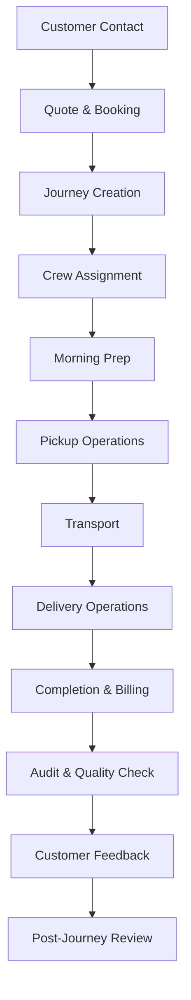

# 🚛 **DAILY DISPATCH JOURNEY - COMPLETE WORKFLOW**

**Project:** C&C CRM (Crate & Container Customer Relationship Management)  
**Version:** 2.6.0  
**Focus:** Complete Daily Dispatch Workflow & Role Responsibilities  
**Last Updated:** January 2025  

---

## 🎯 **OVERVIEW**

This document maps out the **complete daily dispatch journey** from initial customer contact to final delivery completion. It tracks every step, identifies which roles are involved, and details the responsibilities and tools needed at each stage.

---

## 📋 **JOURNEY STAGES OVERVIEW**

### **🔄 Complete Journey Flow**



### **📊 Journey Timeline**

| Stage | Duration | Primary Role | Supporting Roles |
|-------|----------|--------------|------------------|
| **Customer Contact** | 15-30 min | Dispatcher | Admin, Manager |
| **Quote & Booking** | 30-60 min | Dispatcher | Admin |
| **Journey Creation** | 15-30 min | Dispatcher | Admin |
| **Crew Assignment** | 10-20 min | Dispatcher | Manager |
| **Morning Prep** | 30-45 min | Driver, Mover | Dispatcher |
| **Pickup Operations** | 1-3 hours | Driver, Mover | Dispatcher |
| **Transport** | Variable | Driver | Dispatcher, Manager |
| **Delivery Operations** | 1-3 hours | Driver, Mover | Dispatcher |
| **Completion & Billing** | 15-30 min | Driver, Mover | Dispatcher, Admin |
| **Audit & Quality Check** | 30-60 min | Auditor | Manager |
| **Customer Feedback** | 5-15 min | Customer | Driver, Mover |
| **Post-Journey Review** | 15-30 min | Manager | Dispatcher, Admin |

---

## 📞 **STAGE 1: CUSTOMER CONTACT**

### **🎯 Objective**
Initial customer contact, needs assessment, and service inquiry handling.

### **👥 Roles Involved**

#### **🚛 DISPATCHER (Primary)**
```typescript
// Dispatcher responsibilities in customer contact
{
  primaryTasks: [
    "Answer customer calls/emails",
    "Assess customer needs",
    "Gather service requirements",
    "Provide initial estimates",
    "Schedule consultation if needed"
  ],
  tools: [
    "Phone system",
    "Email client",
    "Customer database",
    "Pricing calculator",
    "Calendar/scheduling tool"
  ],
  dataCollection: {
    customerInfo: {
      name: "string",
      phone: "string",
      email: "string",
      address: "string"
    },
    serviceRequirements: {
      pickupAddress: "string",
      deliveryAddress: "string",
      serviceType: "RESIDENTIAL | COMMERCIAL",
      specialRequirements: "string[]",
      preferredDate: "date",
      preferredTime: "time"
    }
  }
}
```

#### **👑 ADMIN (Support)**
- **Oversight:** Monitor customer contact quality
- **Escalation:** Handle complex customer inquiries
- **Training:** Provide dispatcher training and support

#### **👔 MANAGER (Support)**
- **Quality Assurance:** Monitor customer service standards
- **Performance Review:** Review dispatcher performance
- **Strategy:** Develop customer service strategies

### **📱 Interface Requirements**

#### **Desktop Interface (Dispatcher)**
```typescript
// Customer contact interface
{
  customerContactForm: {
    fields: [
      "Customer Name",
      "Phone Number",
      "Email Address",
      "Service Type",
      "Pickup Address",
      "Delivery Address",
      "Preferred Date",
      "Preferred Time",
      "Special Requirements",
      "Notes"
    ],
    validation: "real-time",
    autoSave: true,
    customerLookup: true
  },
  pricingCalculator: {
    serviceType: "dropdown",
    distance: "auto-calculated",
    additionalServices: "checkboxes",
    realTimePricing: true
  }
}
```

#### **Mobile Interface (Limited)**
- **Call forwarding** to mobile devices
- **Basic customer info** lookup
- **Emergency contact** handling

---

## 💰 **STAGE 2: QUOTE & BOOKING**

### **🎯 Objective**
Provide accurate quotes, handle booking process, and secure customer commitment.

### **👥 Roles Involved**

#### **🚛 DISPATCHER (Primary)**
```typescript
// Quote and booking process
{
  quoteProcess: {
    steps: [
      "Calculate service costs",
      "Apply discounts/promotions",
      "Generate quote document",
      "Present quote to customer",
      "Handle negotiations",
      "Secure booking confirmation"
    ],
    pricingFactors: {
      distance: "calculated",
      serviceType: "residential | commercial",
      additionalServices: "array",
      timeConstraints: "rush | standard",
      crewRequirements: "driver + mover | driver only"
    }
  },
  bookingConfirmation: {
    requiredInfo: [
      "Customer signature",
      "Payment method",
      "Service agreement",
      "Insurance coverage",
      "Special instructions"
    ],
    documents: [
      "Quote document",
      "Service agreement",
      "Insurance certificate",
      "Payment receipt"
    ]
  }
}
```

#### **👑 ADMIN (Support)**
- **Pricing Approval:** Approve special pricing requests
- **Contract Review:** Review service agreements
- **Payment Processing:** Handle payment issues

#### **👔 MANAGER (Support)**
- **Quote Review:** Review complex quotes
- **Customer Relations:** Handle customer concerns
- **Strategy:** Develop pricing strategies

### **📱 Interface Requirements**

#### **Desktop Interface (Dispatcher)**
```typescript
// Quote and booking interface
{
  quoteBuilder: {
    serviceCalculator: "interactive",
    discountManager: "percentage-based",
    documentGenerator: "PDF output",
    emailIntegration: "automatic sending"
  },
  bookingSystem: {
    calendarIntegration: "real-time availability",
    paymentProcessing: "secure gateway",
    documentSigning: "digital signatures",
    confirmationEmails: "automatic"
  }
}
```

---

## 📝 **STAGE 3: JOURNEY CREATION**

### **🎯 Objective**
Create detailed journey plan with all necessary information for execution.

### **👥 Roles Involved**

#### **🚛 DISPATCHER (Primary)**
```typescript
// Journey creation process
{
  journeySetup: {
    basicInfo: {
      journeyId: "auto-generated",
      customerInfo: "from booking",
      pickupAddress: "detailed",
      deliveryAddress: "detailed",
      serviceType: "residential | commercial",
      scheduledDate: "date",
      scheduledTime: "time",
      estimatedDuration: "hours"
    },
    serviceDetails: {
      itemsToMove: "inventory list",
      specialRequirements: "array",
      equipmentNeeded: "array",
      insuranceRequirements: "string",
      customerInstructions: "text"
    },
    pricing: {
      basePrice: "number",
      additionalCharges: "array",
      totalAmount: "calculated",
      paymentStatus: "pending | paid"
    }
  },
  routePlanning: {
    pickupRoute: "GPS optimized",
    deliveryRoute: "GPS optimized",
    estimatedDistance: "miles",
    estimatedTime: "hours",
    trafficConsiderations: "real-time"
  }
}
```

#### **👑 ADMIN (Review)**
- **Journey Review:** Review complex journeys
- **Resource Allocation:** Approve resource requirements
- **Quality Assurance:** Ensure journey completeness

### **📱 Interface Requirements**

#### **Desktop Interface (Dispatcher)**
```typescript
// Journey creation interface
{
  journeyBuilder: {
    stepByStepWizard: "guided creation",
    templateLibrary: "pre-built templates",
    autoPopulation: "from booking data",
    validation: "real-time checking"
  },
  routeOptimizer: {
    gpsIntegration: "real-time mapping",
    trafficData: "live updates",
    alternativeRoutes: "multiple options",
    timeEstimates: "accurate calculations"
  }
}
```

---

## 👷 **STAGE 4: CREW ASSIGNMENT**

### **🎯 Objective**
Assign appropriate crew members based on journey requirements and availability.

### **👥 Roles Involved**

#### **🚛 DISPATCHER (Primary)**
```typescript
// Crew assignment process
{
  crewSelection: {
    requirements: {
      driver: "required",
      mover: "required for residential",
      specialSkills: "array",
      equipment: "array",
      vehicle: "truck assignment"
    },
    availabilityCheck: {
      date: "journey date",
      time: "journey time",
      duration: "estimated duration",
      location: "pickup location"
    },
    skillMatching: {
      experience: "years of service",
      specializations: "array",
      performance: "rating",
      availability: "schedule"
    }
  },
  assignmentConfirmation: {
    crewNotification: "immediate",
    journeyDetails: "complete information",
    equipmentAssignment: "vehicle + tools",
    scheduleConfirmation: "acknowledgment"
  }
}
```

#### **👔 MANAGER (Support)**
- **Crew Oversight:** Monitor crew assignments
- **Performance Review:** Consider crew performance
- **Training Needs:** Identify training requirements

#### **🚗 DRIVER & 👷 MOVER (Notification)**
- **Journey Notification:** Receive journey details
- **Schedule Confirmation:** Confirm availability
- **Equipment Check:** Verify equipment availability

### **📱 Interface Requirements**

#### **Desktop Interface (Dispatcher)**
```typescript
// Crew assignment interface
{
  crewManager: {
    availabilityCalendar: "real-time",
    skillMatrix: "searchable database",
    performanceMetrics: "historical data",
    autoAssignment: "AI-powered suggestions"
  },
  notificationSystem: {
    pushNotifications: "immediate",
    emailNotifications: "detailed",
    smsNotifications: "urgent updates",
    confirmationTracking: "acknowledgment"
  }
}
```

#### **Mobile Interface (Crew)**
```typescript
// Crew mobile interface
{
  journeyNotification: {
    pushAlert: "immediate",
    journeyDetails: "complete view",
    acceptDecline: "one-tap response",
    scheduleSync: "calendar integration"
  }
}
```

---

## 🌅 **STAGE 5: MORNING PREP**

### **🎯 Objective**
Prepare crew, vehicle, and equipment for the day's journey.

### **👥 Roles Involved**

#### **🚗 DRIVER (Primary)**
```typescript
// Driver morning prep checklist
{
  vehicleInspection: {
    engine: "start and check",
    tires: "pressure and condition",
    lights: "all working",
    brakes: "function test",
    fuel: "adequate level",
    fluids: "oil, coolant, washer"
  },
  equipmentCheck: {
    movingSupplies: "pads, blankets, straps",
    safetyEquipment: "vests, gloves, first aid",
    communication: "phone, radio, GPS",
    documentation: "journey details, forms"
  },
  journeyReview: {
    route: "review and optimize",
    customerInfo: "contact details",
    specialRequirements: "notes and instructions",
    emergencyContacts: "dispatch, management"
  }
}
```

#### **👷 MOVER (Primary)**
```typescript
// Mover morning prep checklist
{
  personalPrep: {
    safetyEquipment: "vest, gloves, boots",
    communication: "phone, radio",
    documentation: "journey details, forms"
  },
  equipmentCheck: {
    movingTools: "dollies, straps, pads",
    safetyGear: "first aid, emergency contacts",
    documentation: "checklists, forms"
  },
  journeyReview: {
    customerInfo: "contact details",
    specialRequirements: "fragile items, instructions",
    safetyProcedures: "review protocols"
  }
}
```

#### **🚛 DISPATCHER (Support)**
- **Journey Updates:** Provide any last-minute changes
- **Weather Alerts:** Notify of weather conditions
- **Traffic Updates:** Provide route updates

### **📱 Interface Requirements**

#### **Mobile Interface (Driver & Mover)**
```typescript
// Morning prep mobile interface
{
  prepChecklist: {
    interactiveChecklist: "tap to complete",
    photoDocumentation: "required photos",
    digitalSignature: "completion signature",
    autoSubmission: "to dispatch"
  },
  journeyDetails: {
    completeInfo: "all journey details",
    routeOptimization: "real-time updates",
    weatherAlerts: "current conditions",
    trafficUpdates: "live traffic data"
  }
}
```

---

## 📦 **STAGE 6: PICKUP OPERATIONS**

### **🎯 Objective**
Execute pickup operations safely and efficiently with proper documentation.

### **👥 Roles Involved**

#### **🚗 DRIVER (Primary)**
```typescript
// Driver pickup responsibilities
{
  arrival: {
    gpsCheckIn: "automatic location",
    customerContact: "arrival notification",
    photoDocumentation: "location photos",
    safetyAssessment: "site evaluation"
  },
  coordination: {
    customerGreeting: "professional introduction",
    walkthrough: "item identification",
    loadingPlan: "strategy discussion",
    safetyBriefing: "procedure review"
  },
  loading: {
    vehiclePositioning: "optimal placement",
    equipmentSetup: "ramps, dollies, straps",
    loadingSupervision: "oversee loading",
    documentation: "photo and video"
  }
}
```

#### **👷 MOVER (Primary)**
```typescript
// Mover pickup responsibilities
{
  itemHandling: {
    itemInspection: "condition assessment",
    protectionApplication: "pads, blankets",
    loadingExecution: "safe loading",
    securingItems: "straps and restraints"
  },
  documentation: {
    photoCapture: "before and after",
    damageAssessment: "existing damage",
    inventoryTracking: "item list",
    customerSignatures: "digital signatures"
  },
  customerService: {
    professionalInteraction: "courteous service",
    instructionClarification: "answer questions",
    progressUpdates: "regular communication",
    issueResolution: "handle concerns"
  }
}
```

#### **🚛 DISPATCHER (Support)**
- **Real-Time Monitoring:** Track progress
- **Issue Resolution:** Handle problems
- **Customer Communication:** Provide updates

### **📱 Interface Requirements**

#### **Mobile Interface (Driver & Mover)**
```typescript
// Pickup operations mobile interface
{
  stepByStepGuide: {
    currentStep: "highlighted",
    nextStep: "preview",
    completionProgress: "visual indicator",
    timeTracking: "automatic"
  },
  mediaCapture: {
    cameraIntegration: "high quality",
    autoCompression: "optimized",
    metadataCapture: "GPS, timestamp",
    cloudUpload: "automatic"
  },
  communication: {
    crewChat: "real-time messaging",
    dispatchContact: "one-tap calling",
    customerUpdates: "status notifications",
    emergencyAlerts: "urgent communication"
  }
}
```

---

## 🚛 **STAGE 7: TRANSPORT**

### **🎯 Objective**
Safely transport items from pickup to delivery location with real-time tracking.

### **👥 Roles Involved**

#### **🚗 DRIVER (Primary)**
```typescript
// Driver transport responsibilities
{
  driving: {
    safeOperation: "defensive driving",
    routeAdherence: "follow planned route",
    trafficNavigation: "real-time adjustments",
    restBreaks: "scheduled stops"
  },
  monitoring: {
    vehicleStatus: "engine, temperature, fuel",
    cargoSecurity: "regular checks",
    gpsTracking: "continuous location",
    communication: "status updates"
  },
  safety: {
    speedMonitoring: "safe speeds",
    weatherAdaptation: "condition adjustments",
    emergencyResponse: "incident handling",
    documentation: "trip log"
  }
}
```

#### **👷 MOVER (Support)**
- **Cargo Monitoring:** Check item security
- **Rest Support:** Assist with breaks
- **Emergency Response:** Support in incidents

#### **🚛 DISPATCHER (Monitoring)**
- **Real-Time Tracking:** Monitor progress
- **Route Optimization:** Provide updates
- **Customer Updates:** ETA notifications

### **📱 Interface Requirements**

#### **Mobile Interface (Driver)**
```typescript
// Transport mobile interface
{
  navigation: {
    gpsNavigation: "turn-by-turn",
    routeOptimization: "real-time",
    trafficUpdates: "live data",
    alternativeRoutes: "suggestions"
  },
  monitoring: {
    vehicleMetrics: "real-time data",
    cargoStatus: "security checks",
    weatherAlerts: "condition updates",
    emergencyContacts: "quick access"
  },
  communication: {
    handsFree: "voice commands",
    statusUpdates: "automatic",
    dispatchContact: "one-tap",
    customerNotifications: "ETA updates"
  }
}
```

---

## 📦 **STAGE 8: DELIVERY OPERATIONS**

### **🎯 Objective**
Execute delivery operations safely with proper item placement and customer satisfaction.

### **👥 Roles Involved**

#### **🚗 DRIVER (Primary)**
```typescript
// Driver delivery responsibilities
{
  arrival: {
    gpsCheckIn: "automatic location",
    customerContact: "arrival notification",
    siteAssessment: "delivery location",
    unloadingPreparation: "equipment setup"
  },
  coordination: {
    customerGreeting: "professional arrival",
    deliveryPlan: "placement discussion",
    unloadingSupervision: "oversee process",
    finalInspection: "completion check"
  },
  completion: {
    customerSignoff: "delivery confirmation",
    paymentCollection: "if applicable",
    documentation: "completion photos",
    departure: "professional exit"
  }
}
```

#### **👷 MOVER (Primary)**
```typescript
// Mover delivery responsibilities
{
  unloading: {
    itemInspection: "condition check",
    carefulUnloading: "safe handling",
    placementExecution: "customer preference",
    protectionRemoval: "clean delivery"
  },
  documentation: {
    photoCapture: "delivery photos",
    conditionVerification: "item status",
    customerSignatures: "delivery confirmation",
    completionReport: "final documentation"
  },
  customerService: {
    professionalDelivery: "courteous service",
    placementAssistance: "help with positioning",
    instructionProvision: "care instructions",
    satisfactionEnsurance: "customer happiness"
  }
}
```

### **📱 Interface Requirements**

#### **Mobile Interface (Driver & Mover)**
```typescript
// Delivery operations mobile interface
{
  deliveryGuide: {
    stepByStepProcess: "guided delivery",
    customerPreferences: "placement notes",
    photoRequirements: "documentation",
    completionChecklist: "final verification"
  },
  customerInteraction: {
    digitalSignatures: "delivery confirmation",
    satisfactionSurvey: "immediate feedback",
    paymentProcessing: "if applicable",
    followUpScheduling: "future services"
  }
}
```

---

## 💳 **STAGE 9: COMPLETION & BILLING**

### **🎯 Objective**
Complete journey documentation, process billing, and ensure customer satisfaction.

### **👥 Roles Involved**

#### **🚗 DRIVER & 👷 MOVER (Primary)**
```typescript
// Completion responsibilities
{
  documentation: {
    finalPhotos: "delivery completion",
    customerSignatures: "digital confirmation",
    completionReport: "detailed summary",
    mediaUpload: "automatic sync"
  },
  customerInteraction: {
    satisfactionSurvey: "immediate feedback",
    paymentCollection: "if applicable",
    followUpScheduling: "future services",
    professionalDeparture: "courteous exit"
  }
}
```

#### **🚛 DISPATCHER (Support)**
- **Documentation Review:** Verify completion
- **Billing Processing:** Handle payment
- **Customer Follow-up:** Satisfaction check

#### **👑 ADMIN (Review)**
- **Financial Review:** Payment verification
- **Quality Assurance:** Service quality check
- **Customer Relations:** Satisfaction management

### **📱 Interface Requirements**

#### **Mobile Interface (Driver & Mover)**
```typescript
// Completion mobile interface
{
  completionWizard: {
    finalChecklist: "completion verification",
    customerSurvey: "satisfaction feedback",
    paymentProcessing: "secure payment",
    followUpScheduling: "future services"
  },
  documentationUpload: {
    automaticSync: "cloud upload",
    qualityCheck: "photo verification",
    reportGeneration: "completion summary",
    customerCopy: "digital delivery"
  }
}
```

---

## 🔍 **STAGE 10: AUDIT & QUALITY CHECK**

### **🎯 Objective**
Review journey documentation, ensure quality standards, and identify improvement opportunities.

### **👥 Roles Involved**

#### **🔍 AUDITOR (Primary)**
```typescript
// Auditor responsibilities
{
  documentationReview: {
    photoQuality: "clarity and completeness",
    signatureVerification: "customer confirmation",
    complianceCheck: "regulatory adherence",
    qualityAssessment: "service standards"
  },
  issueIdentification: {
    qualityIssues: "service problems",
    complianceViolations: "regulatory issues",
    safetyConcerns: "safety violations",
    improvementOpportunities: "enhancement areas"
  },
  reporting: {
    auditReport: "detailed findings",
    qualityMetrics: "performance data",
    recommendations: "improvement suggestions",
    complianceStatus: "regulatory status"
  }
}
```

#### **👔 MANAGER (Review)**
- **Quality Oversight:** Review audit findings
- **Performance Management:** Address issues
- **Training Planning:** Identify training needs

### **📱 Interface Requirements**

#### **Desktop Interface (Auditor)**
```typescript
// Audit desktop interface
{
  auditDashboard: {
    journeyQueue: "pending audits",
    qualityMetrics: "performance data",
    complianceStatus: "regulatory tracking",
    reportingTools: "audit reports"
  },
  reviewInterface: {
    mediaViewer: "high-quality display",
    documentationReview: "comprehensive check",
    issueTracking: "problem identification",
    reportGeneration: "detailed reports"
  }
}
```

---

## ⭐ **STAGE 11: CUSTOMER FEEDBACK**

### **🎯 Objective**
Collect and process customer feedback for service improvement and satisfaction measurement.

### **👥 Roles Involved**

#### **Customer (Primary)**
- **Satisfaction Survey:** Complete feedback form
- **Rating Submission:** Provide service rating
- **Comments:** Share detailed feedback

#### **🚛 DISPATCHER (Collection)**
- **Feedback Collection:** Encourage participation
- **Response Management:** Handle feedback
- **Follow-up:** Address concerns

#### **👔 MANAGER (Analysis)**
- **Feedback Analysis:** Review customer input
- **Trend Identification:** Spot patterns
- **Improvement Planning:** Develop enhancements

### **📱 Interface Requirements**

#### **Customer Interface**
```typescript
// Customer feedback interface
{
  feedbackForm: {
    satisfactionRating: "1-5 scale",
    serviceCategories: "specific areas",
    comments: "detailed feedback",
    recommendationLikelihood: "NPS score"
  },
  followUpSystem: {
    thankYouMessage: "appreciation",
    issueResolution: "problem handling",
    futureBooking: "repeat business",
    referralProgram: "word-of-mouth"
  }
}
```

---

## 📊 **STAGE 12: POST-JOURNEY REVIEW**

### **🎯 Objective**
Analyze journey performance, identify improvements, and plan future enhancements.

### **👥 Roles Involved**

#### **👔 MANAGER (Primary)**
```typescript
// Manager post-journey review
{
  performanceAnalysis: {
    efficiencyMetrics: "time and cost",
    qualityMetrics: "service quality",
    customerSatisfaction: "feedback scores",
    safetyMetrics: "incident tracking"
  },
  teamReview: {
    crewPerformance: "individual assessment",
    trainingNeeds: "skill gaps",
    recognition: "outstanding performance",
    improvementAreas: "development needs"
  },
  processImprovement: {
    workflowOptimization: "efficiency gains",
    qualityEnhancement: "service improvements",
    costReduction: "expense optimization",
    customerExperience: "satisfaction improvement"
  }
}
```

#### **👑 ADMIN (Strategic)**
- **Business Analysis:** Financial performance
- **Strategic Planning:** Long-term improvements
- **Resource Allocation:** Future investments

#### **🚛 DISPATCHER (Operational)**
- **Process Feedback:** Operational insights
- **System Improvements:** Tool enhancements
- **Training Input:** Skill development needs

### **📱 Interface Requirements**

#### **Desktop Interface (Manager)**
```typescript
// Post-journey review interface
{
  analyticsDashboard: {
    performanceMetrics: "comprehensive data",
    trendAnalysis: "historical patterns",
    comparisonTools: "benchmark analysis",
    reportingTools: "detailed reports"
  },
  teamManagement: {
    performanceReviews: "individual assessments",
    trainingPlanning: "skill development",
    recognitionSystem: "achievement tracking",
    improvementTracking: "progress monitoring"
  }
}
```

---

## 📈 **PERFORMANCE METRICS**

### **🎯 Key Performance Indicators**

#### **📊 Journey Efficiency**
```typescript
// Journey efficiency metrics
{
  timeMetrics: {
    totalDuration: "actual vs estimated",
    pickupTime: "arrival to departure",
    transportTime: "pickup to delivery",
    deliveryTime: "arrival to completion"
  },
  costMetrics: {
    fuelCost: "actual vs budgeted",
    laborCost: "crew time and rates",
    equipmentCost: "tools and supplies",
    totalCost: "overall expense"
  },
  qualityMetrics: {
    customerSatisfaction: "feedback scores",
    damageRate: "item damage percentage",
    completionRate: "successful deliveries",
    safetyIncidents: "safety record"
  }
}
```

#### **📱 Mobile Performance**
```typescript
// Mobile performance metrics
{
  appPerformance: {
    loadTime: "app startup speed",
    responseTime: "interaction speed",
    errorRate: "app crash frequency",
    batteryUsage: "power consumption"
  },
  userExperience: {
    taskCompletion: "successful task completion",
    userSatisfaction: "app rating",
    featureAdoption: "feature usage",
    supportRequests: "help requests"
  }
}
```

---

## 🚀 **OPTIMIZATION OPPORTUNITIES**

### **📱 Mobile Optimization**

#### **1. Real-Time Communication**
- **Push Notifications:** Instant updates
- **Live Chat:** Real-time messaging
- **Voice Commands:** Hands-free operation
- **Video Calls:** Visual communication

#### **2. Automation Features**
- **Auto-Documentation:** Automatic photo capture
- **Smart Routing:** AI-powered route optimization
- **Predictive Analytics:** Journey outcome prediction
- **Auto-Reporting:** Automated report generation

#### **3. Enhanced Safety**
- **Real-Time Monitoring:** Live safety tracking
- **Emergency Response:** Instant emergency alerts
- **Safety Checklists:** Digital safety protocols
- **Incident Reporting:** Automated incident documentation

### **📊 Process Optimization**

#### **1. Workflow Streamlining**
- **Digital Forms:** Paperless documentation
- **Auto-Sync:** Real-time data synchronization
- **Smart Scheduling:** AI-powered scheduling
- **Predictive Maintenance:** Equipment maintenance prediction

#### **2. Quality Enhancement**
- **Quality Monitoring:** Real-time quality tracking
- **Performance Analytics:** Detailed performance analysis
- **Training Integration:** On-the-job training
- **Continuous Improvement:** Ongoing optimization

---

## 📋 **IMPLEMENTATION CHECKLIST**

### **✅ Daily Dispatch Journey Implementation**

#### **1. System Setup**
- [ ] **Role-based interfaces** configured for all roles
- [ ] **Mobile applications** deployed for field operations
- [ ] **Real-time tracking** implemented
- [ ] **Communication systems** integrated
- [ ] **Documentation tools** configured

#### **2. Process Training**
- [ ] **Dispatcher training** completed
- [ ] **Crew training** completed
- [ ] **Manager training** completed
- [ ] **Auditor training** completed
- [ ] **Customer interface** tested

#### **3. Quality Assurance**
- [ ] **Performance monitoring** set up
- [ ] **Quality metrics** established
- [ ] **Feedback systems** implemented
- [ ] **Improvement processes** defined
- [ ] **Continuous monitoring** established

---

**🎯 This comprehensive daily dispatch journey ensures that every step is clearly defined, every role understands their responsibilities, and every tool is optimized for efficient field operations. The mobile-first approach ensures that field personnel can perform their tasks effectively on mobile devices while maintaining full functionality for office-based users.** 